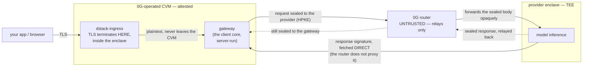

# 0g-pc-e2ee

End-to-end-encrypted inference on the **0G Private Computer**. Your prompt is
sealed to an attested provider enclave, and every response is signed by that
enclave — so the infrastructure carrying the request, including 0G's own router,
can route and bill it without being able to read it or forge a reply.

**"E2EE" here is the broad sense** — both halves of a secure channel to the
enclave: **confidentiality** (the prompt and tool definitions are sealed) *and*
**authenticity** (hardware attestation plus a per-response signature). Not
confidentiality alone.

> **Why this repository is public.** So that the claims above can be *checked*.
> The security of the product rests on outsiders being able to read the verification
> code and the wire spec — both here — and the exact manifest that runs in production,
> which is published as a Release asset (git holds its `:latest` development form). That,
> rather than community development, is what the openness is for.

## The shape of it

Two containers are omitted for clarity: `cvm-identity`, an init container that names
this replica and exits, and `prometheus-agent`. All four are inside the measured
manifest — see [`deploy/phala/README.md`](deploy/phala/README.md).

The gateway runs the **same client core** a caller would otherwise run locally —
verify the provider's attestation quote, seal the request to it, verify the
signature on the way back — just hosted, so browsers and thin clients get it with
no install. That is the trade it makes: one more attested party to trust, in
exchange for zero client-side work. Which is exactly why the gateway publishes
enough evidence to be checked rather than believed.

## Start here

| You are | Go to |
|---|---|
| **using a 0G-hosted gateway** and want to know whether to trust it | [`docs/verifying-the-gateway.md`](docs/verifying-the-gateway.md) — one command, what a `PASS` does and does not prove, and the same procedure by hand with `curl` / `openssl` / `jq` |
| **auditing the design** | [`docs/design/trust-chain.md`](docs/design/trust-chain.md) — every hop and where its trust bottoms out → [`protocol/SPEC.md`](protocol/SPEC.md) — the normative wire format → the **`docker-compose.release.yml` attached to a [Release](https://github.com/0gfoundation/0g-pc-e2ee/releases)**, which is the manifest actually hashed into the attestation. The [`deploy/phala/docker-compose.yml`](deploy/phala/docker-compose.yml) in git is the same file with the gateway image left on `:latest` for development — readable, but it will not match a deployment |

Those are the two audiences this repository is written for. The rest of it —
the gateway implementation, the deployment runbook, the load-test rig — is 0G's
own engineering, readable but not offered as an entry point.

## Layout

Two Go modules:

| | |
|---|---|
| [`protocol/`](protocol/) | the wire contract: sealing, response-signature verification, quote parsing, and [`SPEC.md`](protocol/SPEC.md), which is normative. Every participant depends on this one module so none of them can drift from the others |
| [`client/`](client/) | the client core and its forms. [`cmd/gateway`](client/cmd/gateway) is the 0G-operated, attested form that is actually deployed; [`cmd/pcverify`](client/cmd/pcverify) is the read-only verifier users run. The sidecar and in-process SDK forms exist here but are internal for now |

And three directories that are not modules:

| | |
|---|---|
| [`docs/`](docs/) | [`verifying-the-gateway.md`](docs/verifying-the-gateway.md) for users; [`design/`](docs/design/) for the trust model, the router path, and the request envelope |
| [`deploy/`](deploy/) | [`phala/`](deploy/phala/) is the CVM deployment. Its `docker-compose.yml` is the *source* of the measured manifest, but carries `:latest` for development — the digest-pinned `docker-compose.release.yml` on a Release is what a deployment actually runs and what the attestation covers; [`grafana/`](deploy/grafana/) is the operational dashboard |
| [`loadtest/`](loadtest/) | capacity measurement for the gateway. Internal |

## Status

**Beta.** Interfaces will change. Specifically, and stated the same way the
user-facing document states it:

- The hosted gateway is **tier 2.5** — cheating is *publicly detectable*, not
  *prevented*. Detection requires that somebody actually run the verification;
  a user who skips it is trusting 0G by default.
- **Endpoint identity is closed**: `pcverify -gateway <domain>` proves the TLS session
  terminates inside a genuine TDX enclave that minted the certificate served **on the
  connection `pcverify` made**. One domain can be several CVMs, each with its own key,
  so that is not automatically the certificate your browser negotiated — see the replica
  note in [Current limits](docs/verifying-the-gateway.md#current-limits).
- **Code identity is closed for the images we deploy on.** The OS-image allowlist
  ([`client/evidence/osimages.json`](client/evidence/osimages.json)) carries the
  deployed image, derived from the published guest-OS release and confirmed against a
  live quote — which is what establishes that the guest enforced the binding between
  the attestation and the manifest. An image not on that list *fails*, so a new OS
  version needs an entry before deployment. See
  [Current limits](docs/verifying-the-gateway.md#current-limits) for the two caveats on
  how the entries were derived.
- The **provider** hop — the one the gateway walks on your behalf — is wired end to end,
  and the deployed gateway splits into enforce and warn:
  - **enforced**: DCAP quote verification with its `report_data` binding (a provider that
    fails it is not used), and the §8 response signature (a response that does not verify
    is not returned).
  - **warn only**: the measurement allowlist (hop 3) — empty, and unlike the gateway's it
    needs a shape change before it can be filled at all — and the on-chain signer
    cross-check (hop 5), which is wired with its enforce switch deliberately off.

  [`trust-chain.md`](docs/design/trust-chain.md) marks the status of every link.

## The other end

The protocol's provider side is [`0g-serving-broker`](https://github.com/0gfoundation/0g-serving-broker),
and the router the client seals *through* — and does not trust — is 0G's L7
aggregating router. Both are 0G's own implementations; there are no third-party
ones. So [`protocol/SPEC.md`](protocol/SPEC.md) is published to be **audited**,
not to be implemented against.
