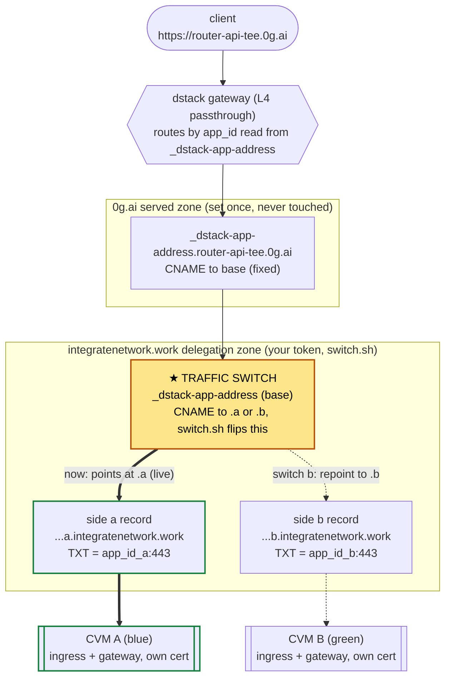

# Blue/green deployment for the cloud-TEE gateway

How to run two gateway CVMs side by side and cut traffic between them with zero
downtime and instant rollback. Read [`README.md`](./README.md) first — this
document assumes its record model, the `app_id`-from-compose binding, and the
Let's Encrypt notes.

## Why blue/green here is a DNS pointer flip, not a load-balancer weight

The gateway's `app_id` is `SHA-256(app-compose)` **truncated to 20 bytes** (which
is why an app id is 40 hex characters, not 64 — `dstack-util` does
`truncate(compose_hash, 20)`; recompute it that way or it will never match), and
the compose embeds the gateway image **by digest**. So a new gateway build is a
**different `app_id`** —
a separate, separately-attested CVM (README "Pin the image digest"). That single
fact shapes everything:

- **dstack only spreads traffic *within one `app_id`*.** Deploy N CVMs from the
  *same* compose and dstack's gateway picks among them per connection ("when
  using the app ID, the load balancer selects one of the available instances" —
  though the selection is a connect race, not round-robin; see
  [Scaling one side](#scaling-one-side-replicas)). That is horizontal scaling /
  HA, and it is **orthogonal** to releases.
- **Two different images are two unrelated apps.** dstack will not blend traffic
  across them, so a release cannot be a weighted canary at this layer. It is an
  **all-or-nothing flip** of one record: `_dstack-app-address.<DOMAIN>`, the TXT
  the dstack gateway reads to learn which `app_id` owns the domain.

So "blue" and "green" are two CVMs with two `app_id`s, both serving `<DOMAIN>`,
and releasing = repointing `_dstack-app-address.<DOMAIN>` from one to the other.
[`switch.sh`](./switch.sh) does that flip safely.

> **What actually sets `app_id` — the sides must be different builds.** dstack
> measures the compose *text*, and the only literal, side-distinguishing field in
> it is the **gateway image digest**. `DOMAIN`, `DELEGATION_ZONE`,
> `GATEWAY_DOMAIN`, `ZG_GATEWAY_ROUTER_URL` and friends are `${...}` placeholders
> injected from the CVM's encrypted env at boot, so **changing them does not
> change `app_id`** (the compose comments call this out for the router URL). Their
> *values* are invisible to `app_id`, but the **`allowed_envs` list is part of the
> measured app-compose** — so it must be **identical on both sides**, and the two
> sides then differ by exactly the image digest. Keep `DNS_SETUP_MODE` and
> `ACME_STAGING` **permanently listed** in `allowed_envs` (a fixed superset) and
> toggle behaviour by the injected *value*, never by adding/removing the key —
> otherwise `allowed_envs` differs and the sides diverge by more than the image.
> The consequence that matters here: run the **same image** on both sides and they
> share one `app_id` — dstack sees one app with two replicas, both per-side
> records carry the same value, and the traffic switch **cannot select between
> them**. Blue/green only isolates the two sides when they are genuinely
> different gateway builds (the normal release case). To rehearse the flow before
> a real release, use two different builds, not the same image twice.

> **No percentage canary.** If you need gradual rollout, it has to be a *replica*
> story (same `app_id`, more instances) or a second layer you build yourself.
> The mechanism here gives fast atomic cutover + fast rollback, not 5%/50%/100%.

## Releasing a new build (fast path)

The common case, with side a live and releasing a new build as side b. `switch.env`
holds the token ([One-time setup](#one-time-setup)); details are in the sections
below.

```sh
./switch.sh acme b                          # 1. aim the issuance switch at side b FIRST
./deploy.sh deploy --side b --release latest # 2. deploy side b — new image digest (=> new
                                            #    app_id); deploy.sh sets DELEGATION_ZONE=
                                            #    b.integratenetwork.work and DNS_SETUP_MODE=print,
                                            #    then waits on b's /readyz by app-id
./switch.sh switch b                        # 3. probe b's /readyz directly, flip traffic, confirm b is
                                            #    really serving (cert changed) + /healthz; auto-rollback otherwise
phala cvms delete --cvm-id <side a>         # 4. once b is confirmed live, retire a to free resources
```

Step 2 is [`deploy.sh`](./deploy.sh) rather than a dashboard form because the
side's `DELEGATION_ZONE`, `DNS_SETUP_MODE` and measured app-compose flags are
exactly the things the two sides must agree on — see
[README "Deploy"](./README.md#deploy). It also refuses to build a side whose
issuance switch is still pointed elsewhere, which is step 1's whole purpose.

With `PLATFORM_BASE` set in `switch.env`, step 3 checks side b's **readiness**
before the flip — can it actually serve, not just is it listening — so a b that
cannot verify any provider is rejected instead of briefly taking traffic. Allow it
time: a cold side must finish its first warmer sweep, which is why the probe window
is minutes (see
[Health-checking the standby](#health-checking-the-standby-side)).

> **About the certificate (step 1).** Side b serves the same `router-api-tee.0g.ai`
> and needs its own cert for it. **Side b's own dstack-ingress issues that cert on
> first boot** (the key is generated in-enclave); `acme b` does not issue anything
> — it just points `_acme-challenge.router-api-tee.0g.ai` at b's sub-zone so b's
> ACME dns-01 challenge can validate. Aim it there **before** deploying b, so b
> issues cleanly on first boot instead of failing in a retry loop against a
> challenge record still pointed at a (which burns the 5-failed-validations-per-hour
> budget — shared per hostname, so it can block a too — or trips
> `DNS_SETUP_TIMEOUT` and restarts b without a cert). `switch b` moves issuance to
> b as well, so the live side always ends up owning renewal. See
> [Certificates](#certificates-the-issuance-switch-and-rate-limits) for the rare
> case where you stage b for days before cutting over.
>
> Don't run step 4 until you've confirmed b — while a is alive, `./switch.sh
> rollback` is an instant undo.

## The record architecture

The served zone (`0g.ai`) is operator-delegated and we hold no token for it, so
**nothing in this scheme edits `0g.ai`** — its three CNAMEs already point into
the delegation zone and never move again. Everything happens in the delegation
zone (`integratenetwork.work`), which the deploy token controls. Each side runs
in its own delegation **sub-zone** so the records each CVM auto-manages never
collide with the other side's:

```
① served zone 0g.ai — static, set once, NEVER touched again:
     router-api-tee.0g.ai                      CNAME → router-api-tee.0g.ai.integratenetwork.work
     _dstack-app-address.router-api-tee.0g.ai  CNAME → _dstack-app-address.router-api-tee.0g.ai.integratenetwork.work
     _acme-challenge.router-api-tee.0g.ai      CNAME → _acme-challenge.router-api-tee.0g.ai.integratenetwork.work

② delegation zone integratenetwork.work — the SWITCH LAYER (switch.sh owns these):
     router-api-tee.0g.ai.integratenetwork.work                     CNAME → <GATEWAY_DOMAIN>     (static; set once)
     _dstack-app-address.router-api-tee.0g.ai.integratenetwork.work CNAME → …a… | …b…            ← ★ traffic switch
     _acme-challenge.router-api-tee.0g.ai.integratenetwork.work     CNAME → …a… | …b…            ← issuance switch

③ delegation zone — PER-SIDE, each CVM's dstack-ingress writes ITS OWN:
     side a (DELEGATION_ZONE=a.integratenetwork.work):
       _dstack-app-address.router-api-tee.0g.ai.a.integratenetwork.work  TXT = <app_id_a>:443
       _acme-challenge.router-api-tee.0g.ai.a.integratenetwork.work      TXT = <acme token, during issuance>
     side b (DELEGATION_ZONE=b.integratenetwork.work):
       _dstack-app-address.router-api-tee.0g.ai.b.integratenetwork.work  TXT = <app_id_b>:443
       _acme-challenge.router-api-tee.0g.ai.b.integratenetwork.work      TXT = <acme token, during issuance>
```

A client connecting to `router-api-tee.0g.ai` resolves ① → ② → ③, so the dstack
gateway reads whichever `app_id` the **traffic switch** (②) currently points at,
and routes L4 to that CVM, where its dstack-ingress terminates TLS with its own
Let's Encrypt cert for `router-api-tee.0g.ai`.

The whole cutover is that **one CNAME** in ② — `switch.sh switch a|b` repoints it
at the chosen side's per-side record; everything else is fixed. Solid = the live
path, dashed = the alternate the flip selects:



**Why sub-zones need no extra token.** dstack-ingress's Cloudflare provider
resolves the **longest parent zone** the token can see, so
`DELEGATION_ZONE=a.integratenetwork.work` is written into the real
`integratenetwork.work` zone — `a.` / `b.` are just record-name prefixes, not
Cloudflare zones. One token scoped to `integratenetwork.work` covers both sides
*and* the switch layer.

**What actually moves on a release.** Only the **traffic switch** (② line 2).
The **issuance switch** moves only when a side needs to obtain/renew its cert;
the **serving alias** (② line 1) is set once to `GATEWAY_DOMAIN` and never moves.

**Each side must run `DNS_SETUP_MODE=print`.** dstack-ingress boots with a strict
pre-check (default `DNS_SETUP_MODE=wait`): it blocks until the served
`<name>.<DOMAIN>` CNAME resolves *directly* to `<name>.<DOMAIN>.<DELEGATION_ZONE>`
— one hop, exact match. Here the served CNAMEs stay pinned at the base zone (①)
while a side runs under `DELEGATION_ZONE=a/b.…`, so that check never matches and
the side would block in `wait` until `DNS_SETUP_TIMEOUT` and then exit without a
cert. `DNS_SETUP_MODE=print` (see [`docker-compose.yml`](./docker-compose.yml))
skips **only** the container's own pre-check and proceeds to issue. Let's Encrypt
and the dstack gateway do ordinary resolution, which follows the full chain
① → ② → ③, so issuance and routing still work — **validated**: a side boots under
its sub-zone, issues its cert, and serves. It is injected (`${DNS_SETUP_MODE:-wait}`),
so `DNS_SETUP_MODE` must be in the app's `allowed_envs` — kept there **permanently
and identically on both sides** (see the `app_id` note above), toggled by value.

## One-time setup

You need a Cloudflare API token that can **edit DNS in `integratenetwork.work`**
(the same one the CVMs use for delegation is fine). Put it — and any config
overrides — in `switch.env` next to the script; it is loaded automatically and
git-ignored (it holds the token):

```sh
cp deploy/phala/switch.env.example deploy/phala/switch.env
# edit switch.env: set CF_API_TOKEN=... (defaults already match production)
./switch.sh status
```

Or supply it via the environment instead (`CF_API_TOKEN=... ./switch.sh …`); the
real environment overrides `switch.env`, and `--env-file PATH` points elsewhere.
Also set `PLATFORM_BASE` (e.g. `in1.phala.network`) in `switch.env` to enable the
per-side pre-switch probe ([Health-checking the standby](#health-checking-the-standby-side)).

1. **Serving alias (once).** The one record you create by hand in the delegation
   zone: `router-api-tee.0g.ai.integratenetwork.work` CNAME → your `GATEWAY_DOMAIN`
   (the `_.<cluster>.phala.network` value from the compose). It never changes, and
   both sides route through the same cluster, so one static value serves both.
   `switch.sh setup` does it for you:

   ```sh
   GATEWAY_DOMAIN=_.<cluster>.phala.network ./switch.sh setup
   # already running a single instance? run `./switch.sh setup` with GATEWAY_DOMAIN
   # unset and it prints the value the container currently publishes, to pin as-is.
   ```

   Everything else in `integratenetwork.work` is automatic: the two switch records
   (`_dstack-app-address.…` and `_acme-challenge.…`) are created and flipped by
   `switch`/`acme`, and each side's `…a/b…` records are written by that CVM's own
   dstack-ingress. You never hand-edit those.

2. **Deploy side a and side b.** Two CVMs from [`docker-compose.yml`](./docker-compose.yml).
   The **image digest** is what gives each side its own `app_id` (above), so the
   two sides must be pinned to **different** gateway builds; `DELEGATION_ZONE`
   differs too, but only to keep their DNS records apart:

   | | side a (blue) | side b (green) |
   |---|---|---|
   | gateway image digest | current build | **new build** (this is what makes it a distinct `app_id`) |
   | `DELEGATION_ZONE` | `a.integratenetwork.work` | `b.integratenetwork.work` |
   | `DNS_SETUP_MODE` | `print` | `print` |
   | `DOMAIN` | `router-api-tee.0g.ai` | `router-api-tee.0g.ai` |

   `allowed_envs` **must be identical on both sides** and list `DNS_SETUP_MODE`
   and `ACME_STAGING` **permanently** — dstack drops any encrypted var not listed
   (a side would fall back to `wait` and block), and because `allowed_envs` is part
   of `app_id`, a list that differs between sides (or that you edit to toggle
   staging) makes the sides diverge by more than the image. Toggle those two by
   **value**, never by adding/removing the key. Everything else (`GATEWAY_DOMAIN`,
   `CLOUDFLARE_API_TOKEN`, gateway env) stays as in the shared compose. Each side,
   on boot, publishes its own `_dstack-app-address.…a/b…` and tries to issue a cert
   for `router-api-tee.0g.ai` — for which it needs the issuance switch (next section).

3. **Confirm the switch layer.** `./switch.sh status` prints where the traffic
   and issuance switches point and each side's published `app_id`.

## Certificates: the issuance switch and rate limits

For an **instant** flip, both sides must already hold a valid cert for
`router-api-tee.0g.ai` at the moment you cut over. ACME dns-01 validates the
single record `_acme-challenge.router-api-tee.0g.ai`, which can only resolve to
one side at a time — that is the **issuance switch**.

To let side b obtain its first cert (side a keeps serving throughout):

```sh
./switch.sh acme b        # point _acme-challenge at side b; wait for it to issue
# …watch side b's logs / status until it has a cert…
# then cut over (switch b) — see the fast path above
```

`switch b` moves the issuance switch to the new live side, so it renews itself
automatically after the cutover; you do **not** need to point `_acme-challenge`
back at a by hand in the fast path.

**The one exception — staging b for a long time before cutting over.** While
`_acme-challenge` points at b, the still-live side a cannot renew. Its cert has
weeks of validity, so a minutes-to-hours window is harmless — but if you leave b
staged for **days** and a's cert enters its ~30-day renewal window meanwhile, a
would fail to renew. In that case point it back until you cut over:

```sh
./switch.sh acme a        # only if b will sit staged for a long time
```

Rule of thumb: **the issuance switch should rest on whichever side is live**,
borrowed only for the minutes it takes the standby to issue.

**Let's Encrypt limits (README repeats these).** The binding limit is **5
duplicate certificates per exact hostname per rolling week**. Each fresh CVM
issues once from an empty `cert-data` volume, so you can stand up ~5 fresh CVMs
for `router-api-tee.0g.ai` per week. A real cutover costs ~1 issuance and is well
within budget; what burns it is **re-building a side repeatedly against the
production hostname while iterating**. When iterating, test on the staging CA
(`ACME_STAGING=true` in that side's compose — untrusted certs, high limits) and
switch to the production compose only once it works.

## Cutover

```sh
./switch.sh status                        # confirm current live side + target health
./switch.sh switch b                      # flip traffic (and issuance) to side b
```

`switch.sh switch b`:

1. refuses if b is already live;
2. **gate 1** — reads side b's published `app_id` from the delegation zone;
   aborts if b has not published one (its CVM is not up);
3. **gate 2** — probes side b's **readiness** (`/readyz`) **directly** before
   sending it any traffic (via `PLATFORM_BASE`, or an explicit `--probe-url`),
   retrying up to `PROBE_RETRIES` times `PROBE_INTERVAL` apart; refuses to switch
   if b never becomes ready. This asks whether b can actually *serve* — not merely
   whether its process is up — so a side that cannot verify any provider never
   receives traffic while the live side is still serving from a warm cache. See
   [Health-checking the standby](#health-checking-the-standby-side);
4. repoints the traffic + issuance switches at b;
5. **confirms the cutover actually took effect, cache-proof.** It polls
   `https://router-api-tee.0g.ai/healthz` **and** the served TLS cert fingerprint:
   success needs `/healthz` OK **and** the cert to have changed to b's. Because the
   dstack gateway caches the `_dstack-app-address` lookup (observed ~30 s), a bare
   `/healthz` can return 200 from the *old* side for a while after the flip — the
   fingerprint check refuses to be fooled by that, waiting until traffic genuinely
   lands on b. If it never does within the window (`VERIFY_RETRIES` × `VERIFY_INTERVAL`,
   ~2× `TTL` by default), it **auto-rolls-back** to a and exits non-zero.

Useful flags: `--dry-run` (print the Cloudflare changes, apply nothing),
`--yes` (no prompt, for automation), `--probe-url URL` (override the per-side
probe), `--no-verify` (skip the post-switch check + auto-rollback).

## Rollback

```sh
./switch.sh rollback        # flip to the other side
# or explicitly:
./switch.sh switch a
```

Rollback is the same pointer flip in reverse, and it goes through the full
`switch` path (including the pre-switch probe of the side it returns to and the
cache-proof post-switch check). It is **stateless**: with two sides "roll back"
is just "switch to the other one", and which side is live is read from the shared
switch record in DNS — there is no local state file, so every operator on any
machine computes the same target. Because the old side is still running with a
valid cert, rollback is effectively instant (bounded by `TTL` + the gateway route
cache). **Keep the old side running until you are confident in the new one** — a
destroyed side is no longer a rollback target.

## Health-checking the standby side

### `/healthz` and `/readyz` answer different questions

The gateway serves both, and the difference decides which one a gate should use:

| Route | Asserts | Used by | Failing means |
| --- | --- | --- | --- |
| `/healthz` | the process is serving HTTP | container healthcheck (`gateway -health`), which compose uses to gate **dstack-ingress startup**; the post-switch public check | ingress never starts — a dark CVM with no certificate |
| `/readyz` | at least one provider is fully usable — endpoint resolved, quote DCAP-verified, on-chain signer read **and in agreement** (see below) — as of a recent warmer sweep | **gate 2**, the pre-switch standby probe | the cutover stops and the live side keeps serving |

`/healthz` is deliberately *not* widened to cover provider reachability. Because
compose gates the ingress's startup on it, a side booting during an upstream
outage would never bring its ingress up — no traffic, and no ACME certificate
either — instead of coming up and reporting honest errors. Failing the *cutover*
on the same condition is safe, because the live side is unaffected.

> **`/readyz` only has teeth when the warmer is on.** It reports the last sweep's
> result, so with `ZG_GATEWAY_WARM` off there is no sweep to report and the route
> always answers ready — the gate silently becomes liveness-only. The shipped
> compose has the warmer on.

> **`ZG_GATEWAY_ONCHAIN_ENFORCE` widens what this gate asserts, and couples the
> cutover to the chain RPC.** Under warn, a sweep counts a provider ready once its
> signer was *read*; under enforce (the shipped setting) the reading must also
> **agree**, so a provider the registry does not vouch for is not counted — and a
> lookup that fails outright counts against readiness too. The consequence to plan
> for is a **cold** side: a freshly started gateway has no cached signer readings, so
> the cache's grace window has nothing to fall back on, and a side booting during a
> chain-RPC outage reports `warmer_ready_providers` at zero for as long as the outage
> lasts. That is a refused cutover, correctly — you do not want traffic on a side
> that can ground nothing — but it means the chain RPC is now a cutover dependency,
> not only a request-path one. `deploy/phala/README.md` "Notes" has the cache windows
> and the metrics to read.

The readiness window is sized to a **cold first sweep**, not to a DNS TTL:
`PROBE_RETRIES` × `PROBE_INTERVAL` (30 × 10s ≈ 5 min by default). A freshly
started side DCAP-verifies each provider's quote one at a time, fetches Intel
collateral cold, and reads and checks each provider's on-chain signer, so it is
legitimately not-ready for a while.

> **That default assumes today's fleet size.** The sweep is serial, so its duration
> grows with the number of registered providers — and each provider costs more when
> Intel PCS or the chain RPC is slow, which is exactly when a deploy is most likely
> to be under way. If the fleet grows or `warmer_last_success_timestamp_seconds`
> shows sweeps taking minutes, raise `PROBE_RETRIES` to match; the failure mode of
> too small a window is a refused cutover to a side that was going to be fine. Keep this separate from `VERIFY_*`, which sizes the
*post-switch* check against the route cache — the two measure unrelated things.
To fall back to the weaker liveness-only gate, point `--probe-url` at `/healthz`.

> **Rolling back to a side that predates `/readyz`.** That side does not serve the
> route at all — the path falls through its catch-all to the router, which answers
> about itself. `switch.sh` detects the 404 and degrades to `/healthz` with a loud
> warning rather than failing the gate, because the target of a rollback is an older
> image by definition and the emergency path is the worst place to be strict. A
> `503` is different: the route exists and is answering not-ready, which is a real
> verdict, so it keeps retrying and ultimately refuses.

### Reaching the standby at all

`https://<DOMAIN>/healthz` always hits the **live** side, so verifying the
*standby* before cutover needs a way to reach it directly. The dstack platform
gives you one, and it works alongside the custom domain:

> **`https://<app_id>-443s.<PLATFORM_BASE>/readyz`** reaches a specific side
> directly. The `-443s` form is TLS **passthrough** to that CVM's ingress on 443,
> and the gateway routes it by the **app_id in the hostname** — independent of the
> custom domain's `_dstack-app-address` — so it hits the standby even though no
> traffic points at it yet. (Validated on `in1.phala.network`.)

Set `PLATFORM_BASE` (e.g. `in1.phala.network`) in `switch.env` and `switch.sh`
builds this URL from the target side's published `app_id` and probes it
automatically before every switch, refusing to cut over unless the standby reports
ready (retrying `PROBE_RETRIES` times, `PROBE_INTERVAL` apart). `./switch.sh status`
prints each side's probe URL. An explicit `--probe-url` overrides it — including to
downgrade the gate to `/healthz`.

Notes on why other forms don't work here: `<app_id>-8443…` fails because the
gateway port (8443) is deliberately **not** published (a published 8443 would
serve plaintext outside the enclave); `<app_id>-443` **without** the `s` fails
because the gateway would terminate TLS and hand plaintext to the ingress, which
expects TLS. The `s` (passthrough) is the working form.

Even without `PLATFORM_BASE`, `switch.sh` always does **gate 1** (the standby
must be publishing an `app_id`) and the **cache-proof post-switch check +
auto-rollback**, so a dead or broken standby is caught and reverted — just after
a brief blip rather than before. Set `PLATFORM_BASE` to turn that into
verify-before-cut.

## Migrating the current single instance into this scheme

The instance running today uses `DELEGATION_ZONE=integratenetwork.work`, so it
writes the **switch-layer names themselves** (the base-zone
`_dstack-app-address.router-api-tee.0g.ai.integratenetwork.work` etc.) and
**keeps reasserting** the routing one. Migrate by standing a managed side up
beside it under a per-side sub-zone, then retiring the legacy CVM. (You can't
move the legacy instance into a sub-zone "in place": `DELEGATION_ZONE` is an
encrypted-env value, so changing it is a mutation of the one live CVM and leaves
you no second side to cut over to safely.)

1. **Deploy side a** with `DELEGATION_ZONE=a.integratenetwork.work` and
   `DNS_SETUP_MODE=print` (in `allowed_envs`). Make this your **next real gateway
   build** — a different image digest than the legacy instance, so side a has a
   distinct `app_id` and the cutover is a clean pointer flip (a same-image side
   would share the legacy `app_id`, i.e. be treated as a replica of it; see the
   note at the top). It publishes `…a…` records the legacy instance never touches.
2. **Issue side a's cert:** `./switch.sh acme a`. The base-zone `_acme-challenge`
   name is only written transiently during the live instance's own renewals, so
   converting it to a CNAME → side a is safe between renewals; side a completes
   ACME and now holds a valid `router-api-tee.0g.ai` cert.
3. **Verify side a** directly (a probe, per above). It is healthy but takes no
   traffic yet — routing still points at the live instance's TXT.
4. **Cut over and retire the legacy instance promptly, in that order:**
   ```sh
   ./switch.sh switch a          # converts the routing name to a CNAME → side a
   # …then destroy the legacy CVM so it stops reasserting the routing TXT…
   ```
   The legacy instance reasserts the base-zone routing record on its reconcile
   loop, so until it is gone routing can briefly flap between it and side a.
   **This is not an outage:** both serve `router-api-tee.0g.ai` with valid certs,
   so every request succeeds either way — though because side a is a new build, a
   few requests may hit the old build until the legacy CVM is gone. Once it is
   destroyed, the CNAME → side a is stable.
5. You now have side a as the sole managed side. The next release brings up
   **side b** under `b.integratenetwork.work` and uses `switch.sh` normally.

## Scaling one side (replicas)

Independent of releases: to scale or add HA **within** a side, deploy more CVMs
from that side's *exact* compose (same `app_id`). dstack spreads traffic across
them by `app_id`, and each publishes the same `_dstack-app-address` value, so no
switch-layer change is needed. Releases (this document) change `app_id` and flip
the pointer; scaling keeps `app_id` and adds instances. They compose cleanly —
`switch.sh` neither knows nor cares how many CVMs back the side it points at.

**The custom-domain path uses the same selection code as the platform hostname.**
An SNI the gateway holds no cert for and a `…-443s` platform hostname both land in
`tls_passthough::proxy_to_app`, which calls `select_top_n_hosts(app_id)` — so
replicas behind our own domain are selected exactly as they are behind
`<app_id>-443s.<base_domain>`. What that function does is worth knowing before
you plan capacity, because **it is not round-robin and it does not balance by
load**:

1. an id that names an *instance* short-circuits to that CVM (this is what makes
   the standby probe above work);
2. an `app_id` is expanded to its instances, sorted by **WireGuard handshake
   recency**, truncated to `connect_top_n` (upstream default **3**) and **cached
   for `cache_top_n` (default 30s)**;
3. the proxy then races a TCP connect against all of those at once and keeps
   **whichever answers first**, dropping the rest.

`connections` counters exist on each instance but take no part in the decision.
Practically that means the closest/fastest replica wins most connections rather
than traffic splitting evenly — this is HA and headroom, **not** an even spread —
and `connect_top_n = 0` is the only setting that degrades to a per-connection
random pick among healthy instances (also the fallback when handshake data is
unavailable).

Two consequences for testing it:

- **Selection is per TCP connection, not per request.** Any keep-alive client —
  a browser, an OpenAI SDK — pins every request on one connection to one replica.
  A load test that reuses connections will show 100% of traffic on a single CVM
  and prove nothing; disable keep-alive (`curl --no-keepalive`, or a fresh process
  per request) to observe the distribution.
- **Attribute the traffic, don't infer it.** Each CVM publishes its own
  `instance_id` / `app_id` at boot (the `cvm-identity` init container); the
  Prometheus agent applies them as target labels on every scrape, and the gateway
  puts `instance_id` on every log line. So the distribution is a metrics query,
  not an experiment you have to set up:

  ```promql
  sum by (instance_id) (rate(zg_gateway_http_requests_total[5m]))
  ```

  Per *request*, every response also carries `X-0G-Gateway-Instance` naming the
  replica that served it — always on, nothing to enable.

> The `connect_top_n` / `cache_top_n` defaults above are upstream's
> (`gateway/gateway.toml` in Phala-Network/dstack); a cluster operator can set
> them differently, and that config is not visible from outside. Confirm the
> behaviour you actually get on your cluster before relying on it for HA.

## Limitations & things to confirm in your environment

- **No weighted/percentage canary** — atomic flip only (see the top section).
- **Both sides must be in the same dstack cluster.** The serving alias is one
  static value pointing at one cluster's gateway, and a gateway only routes to
  `app_id`s in its **own** cluster — so flipping `_dstack-app-address` to a side in
  another cluster would point the serving gateway at an `app_id` it cannot reach.
  This scheme flips `_dstack-app-address` (+ `_acme-challenge`) only and treats the
  serving alias as fixed. **Migrating to a new cluster** (or running the sides
  across clusters) is not supported as-is; it additionally needs the serving alias
  to become a *switched* record (→ the target side's `GATEWAY_DOMAIN`), a per-side
  `GATEWAY_DOMAIN`/`PLATFORM_BASE`, and Phala's SNI allowlist on both clusters.
  Because the client's gateway and the app-address then live in two records with
  independent DNS caches, that cutover has a brief inconsistency window (shrink it
  by lowering the TTLs first). Defer until a cluster move is actually needed.
- **Standby probe needs `PLATFORM_BASE`** (the dstack platform base domain, e.g.
  `in1.phala.network`) — see [Health-checking the standby](#health-checking-the-standby-side).
- **Cutover latency** is the switch-layer `TTL` (default 60 s) plus the dstack
  gateway's cache of `_dstack-app-address` (**observed ~30 s** on `in1.phala.network`).
  The flip is not sub-second; the post-switch verify window
  (`VERIFY_RETRIES` × `VERIFY_INTERVAL`) must exceed this cache or a slow flush
  reads as a failed switch and triggers an unnecessary rollback.
- **Post-switch verification needs `openssl`** for the cache-proof cert-fingerprint
  check; without it, `switch.sh` falls back to `/healthz`-only, which a cached
  route to the old side can satisfy (it warns when it does).
- **Two CNAME hops** (① → ② → ③ for a TXT lookup) and each side runs
  `DNS_SETUP_MODE=print` — standard and resolver-safe, but if you debug resolution
  by hand, follow the full chain.
- **Replica selection is a connect race, not round-robin, and it is per TCP
  connection** — see [Scaling one side](#scaling-one-side-replicas) before sizing
  a fleet or measuring its distribution.
- **Every managed side is a separate attestation.** A verifier must re-audit each
  side's `app_id` against [`docker-compose.yml`](./docker-compose.yml) per
  README "Verify"; blue and green are audited independently.
