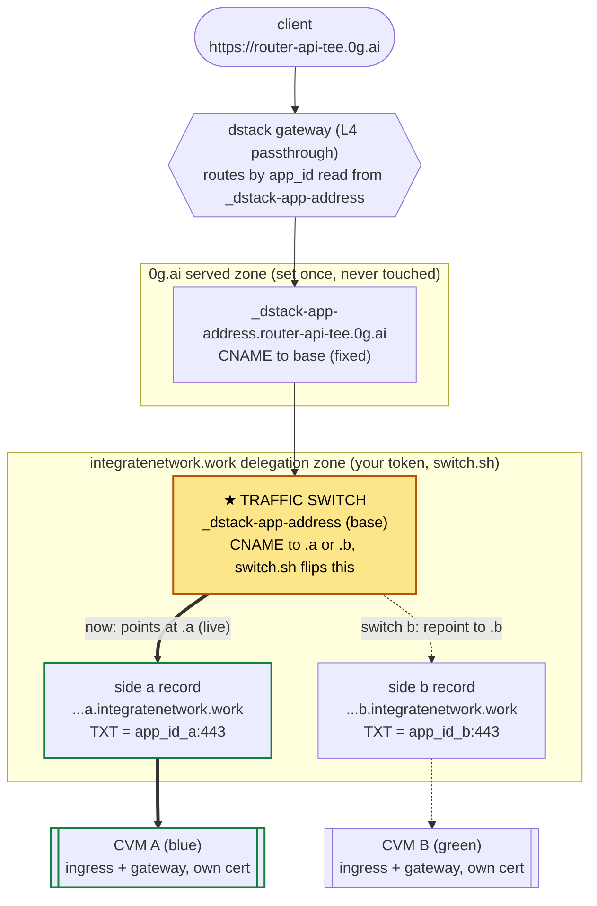

# Blue/green deployment for the cloud-TEE gateway

How to run two gateway CVMs side by side and cut traffic between them with zero
downtime and instant rollback. Read [`README.md`](./README.md) first — this
document assumes its record model, how a deployment is named (`app_id`) and
measured (`compose_hash`), and the Let's Encrypt notes.

## Why blue/green here is a DNS pointer flip, not a load-balancer weight

A dstack `app_id` is 20 bytes (40 hex, not 64) and is assigned when the app is
**created**: `dstack-util` derives it as `truncate(compose_hash, 20)` only when
nothing else assigned one (system_setup.rs `if instance_info.app_id.is_empty()`),
and then it is persisted for the app's life. Creating a **new app** therefore gets
a new `app_id`, whether or not its compose differs from anything already
deployed; **upgrading** an existing app in place does not — it moves
`compose_hash` under the same `app_id`. Each blue/green side is a separately
created, separately attested app, and that alone is what gives the two sides
distinct `app_id`s to point DNS at.

> **So never upgrade a side in place to make it "the new side".** It keeps its
> `app_id`, so the switch record still names it and the platform spreads traffic
> across both CVMs of that id instead of holding the old side steady — a silent
> half-cutover with no record left to flip back.

That single fact shapes everything:

- **dstack only spreads traffic *within one `app_id`*.** Add N instances under
  one `app_id` and dstack's gateway picks among them per connection ("when
  using the app ID, the load balancer selects one of the available instances" —
  though the selection is a connect race, not round-robin; see
  [Scaling one side](#scaling-one-side-replicas)). That is horizontal scaling /
  HA, and it is **orthogonal** to releases.
- **Two CVMs created as separate *apps* are two unrelated apps** — distinct
  `app_id`s whatever their compose says (see the note below; a CVM created
  *under an existing* `app_id` is the other case, an instance of that app).
  dstack will not blend traffic
  across them, so a release cannot be a weighted canary at this layer. It is an
  **all-or-nothing flip** of one record: `_dstack-app-address.<DOMAIN>`, the TXT
  the dstack gateway reads to learn which `app_id` owns the domain.

So "blue" and "green" are two CVMs with two `app_id`s, both serving `<DOMAIN>`,
and releasing = repointing `_dstack-app-address.<DOMAIN>` from one to the other.
[`switch.sh`](./switch.sh) does that flip safely.

> **What actually sets `app_id` — creating the CVM, not the compose text.** Under
> a KMS key provider (which is what Phala Cloud runs) dstack assigns an app its id
> when the app is **created**, and keeps it for the app's life; the fallback
> derivation `truncate(compose_hash, 20)` runs only when nothing assigned one,
> which is the local-key-provider case, not ours. On Phala Cloud the id is the KMS
> app's contract address — in a CVM's info dump `app_id` and `contract_address`
> are the same value, and neither is a prefix of `compose_hash`.
>
> Which of the two a new CVM gets is decided at creation, by whether the VMM call
> carries an `app_id` (`vmm_rpc.proto`: "*optional* … if provided, and KMS is
> enabled, it assumes the app is upgraded from given app_id"):
>
> | creating a CVM | result |
> |---|---|
> | **without** an `app_id` | a **new app** — its own `app_id`, whatever the compose says |
> | **with** an existing `app_id` | another **instance of that app** — same `app_id`; this is what an upgrade and [Scaling one side](#scaling-one-side-replicas) do |
>
> So **each side must be created as its own app**, and then the two have distinct
> `app_id`s and the traffic switch can always select between them. The live staging
> pair is the proof: both sides run the *same* gateway image digest — the field
> this note used to call the only thing distinguishing them — yet
>
> ```
> side a  app_id 544ae2f3…  compose_hash e5a80e02…
> side b  app_id 08f84bba…  compose_hash dd79782d…
> ```
>
> Nothing here requires the sides to be different builds. Running the same image
> on both is fine — for rehearsing the flow, or for sitting on a released build
> while the standby is rebuilt — and it does **not** collapse them into one app.
> (What `compose_hash` still governs is the *measurement*: it is what
> `mr_config_id` commits to, so it does distinguish the two sides' quotes.)
>
> `DOMAIN`, `DELEGATION_ZONE`, `ZG_GATEWAY_ROUTER_URL` and friends are `${...}`
> placeholders injected from the CVM's encrypted env at boot, so their *values*
> never reach `compose_hash` — but the **`allowed_envs` list is part of the
> measured app-compose**, and Phala Cloud generates that list from the keys you
> actually enter. Two consequences worth keeping identical on both sides, now for
> operational reasons rather than identity ones: a key you never enter is a key
> the container can never receive, and a list that drifts makes the two sides'
> measured config differ for no reason anyone can explain later. Enter
> `DNS_SETUP_MODE` and `ACME_STAGING` on **both** sides always — `ACME_STAGING`
> even when it is `false` — and toggle by *value*. Today's staging pair shows what
> skipping that costs: side b's list has no `ACME_STAGING`, so side b cannot be
> put on the staging CA at all without a config change and redeploy.

> **No percentage canary.** If you need gradual rollout, it has to be a *replica*
> story (same `app_id`, more instances) or a second layer you build yourself.
> The mechanism here gives fast atomic cutover + fast rollback, not 5%/50%/100%.

## Releasing a new build (fast path)

The common case, with side a live and releasing a new build as side b. `switch.env`
holds the token ([One-time setup](#one-time-setup)); details are in the sections
below.

```sh
./switch.sh acme b           # 1. aim the issuance switch at side b FIRST
phala cvm create ...         # 2. deploy side b — a NEW app (=> its own app_id),
                             #    DELEGATION_ZONE=b.integratenetwork.work, DNS_SETUP_MODE=print
./switch.sh switch b         # 3. probe b's /readyz directly, flip traffic, confirm b is
                             #    really serving (cert changed) + /healthz; auto-rollback otherwise
phala cvm delete <side a>    # 4. once b is confirmed live, retire a to free resources
```

Step 3 checks side b's **readiness** (on `PLATFORM_BASE`, which `switch` requires)
before the flip — can it actually serve, not just is it listening — so a b that
cannot verify any provider is rejected instead of briefly taking traffic. Allow it
time: a cold side must finish its first warmer sweep, which is why the probe window
is minutes (see
[Health-checking the standby](#health-checking-the-standby-side)).

> **About the certificate (step 1).** Side b serves the same `router-api-tee.0g.ai`
> and needs its own cert for it. **Side b's own dstack-ingress issues that cert on
> first boot** (the key is generated in-enclave); `acme b` does not issue anything
> — it just points `_acme-challenge.router-api-tee.0g.ai` at b's sub-zone so b's
> ACME dns-01 challenge can validate. Aim it there **before** deploying b, so b
> issues cleanly on first boot instead of failing in a retry loop against a
> challenge record still pointed at a (which burns the 5-failed-validations-per-hour
> budget — shared per hostname, so it can block a too — or trips
> `DNS_SETUP_TIMEOUT` and restarts b without a cert). `switch b` moves issuance to
> b as well, so the live side always ends up owning renewal. See
> [Certificates](#certificates-the-issuance-switch-and-rate-limits) for the rare
> case where you stage b for days before cutting over.
>
> Don't run step 4 until you've confirmed b — while a is alive, `./switch.sh
> rollback` is an instant undo.

> **Standing a name up for the first time: use `--no-verify` on step 3.** The fast
> path above assumes the served name already CNAMEs into the delegation zone, so
> flipping the switch changes what that name serves and the post-switch
> health-check means something. It does not yet on a name whose public CNAME still
> points at the old origin: the check reaches the OLD origin no matter which side
> the switch points at, so it cannot fail correctly — and cannot pass correctly
> either, since a pass would only say the old origin is up. Worse, `switch` treats
> the failure as a bad cutover and auto-rolls-back when there is a previous side.
>
> `HEALTH_PATH` is worth a look at the same time: it defaults to `/healthz`, which
> every gateway serves, but the origin behind the name may not. Ours answered
> `404` there, so the pre-cutover verify failed on the path rather than on
> anything real. Once the name points here, the default is correct again — the
> gateway is what answers it.

## The record architecture

The served zone (`0g.ai`) is operator-delegated and we hold no token for it, so
**nothing in this scheme edits `0g.ai`** — its three CNAMEs already point into
the delegation zone and never move again. Everything happens in the delegation
zone (`integratenetwork.work`), which the deploy token controls. Each side runs
in its own delegation **sub-zone** so the records each CVM auto-manages never
collide with the other side's:

```
① served zone 0g.ai — static, set once, NEVER touched again:
     router-api-tee.0g.ai                      CNAME → router-api-tee.0g.ai.integratenetwork.work
     _dstack-app-address.router-api-tee.0g.ai  CNAME → _dstack-app-address.router-api-tee.0g.ai.integratenetwork.work
     _acme-challenge.router-api-tee.0g.ai      CNAME → _acme-challenge.router-api-tee.0g.ai.integratenetwork.work

② delegation zone integratenetwork.work — the SWITCH LAYER (switch.sh owns these):
     router-api-tee.0g.ai.integratenetwork.work                     CNAME → _.<live side's cluster> ← serving alias
     _dstack-app-address.router-api-tee.0g.ai.integratenetwork.work CNAME → …a… | …b… (| …c…)    ← ★ traffic switch
     _acme-challenge.router-api-tee.0g.ai.integratenetwork.work     CNAME → …a… | …b… (| …c…)    ← issuance switch

③ delegation zone — PER-SIDE, each CVM's dstack-ingress writes ITS OWN:
     side a (DELEGATION_ZONE=a.integratenetwork.work):
       _dstack-app-address.router-api-tee.0g.ai.a.integratenetwork.work  TXT = <app_id_a>:443
       _acme-challenge.router-api-tee.0g.ai.a.integratenetwork.work      TXT = <acme token, during issuance>
       router-api-tee.0g.ai.a.integratenetwork.work                      CNAME → <that side's GATEWAY_DOMAIN>   ← written, never read
     side b (DELEGATION_ZONE=b.integratenetwork.work):
       _dstack-app-address.router-api-tee.0g.ai.b.integratenetwork.work  TXT = <app_id_b>:443
       _acme-challenge.router-api-tee.0g.ai.b.integratenetwork.work      TXT = <acme token, during issuance>
       router-api-tee.0g.ai.b.integratenetwork.work                      CNAME → <that side's GATEWAY_DOMAIN>   ← written, never read
     side c, the optional cold standby (DELEGATION_ZONE=c.integratenetwork.work): the same three records
       — see Cross-cluster fallback
```

A client connecting to `router-api-tee.0g.ai` resolves ① → ② → ③, so the dstack
gateway reads whichever `app_id` the **traffic switch** (②) currently points at,
and routes L4 to that CVM, where its dstack-ingress terminates TLS with its own
Let's Encrypt cert for `router-api-tee.0g.ai`.

The whole cutover is that **one CNAME** in ② — `switch.sh switch a|b` repoints it
at the chosen side's per-side record; everything else is fixed. Solid = the live
path, dashed = the alternate the flip selects:


```mermaid
flowchart TD
    C(["client<br/>https://router-api-tee.0g.ai"]) --> GW
    GW{{"dstack gateway (L4 passthrough)<br/>routes by app_id read from _dstack-app-address"}}

    subgraph Z0 ["0g.ai served zone (set once, never touched)"]
        R0["_dstack-app-address.router-api-tee.0g.ai<br/>CNAME to base (fixed)"]
    end

    subgraph ZD ["integratenetwork.work delegation zone (your token, switch.sh)"]
        SW["★ TRAFFIC SWITCH<br/>_dstack-app-address (base)<br/>CNAME to .a or .b, switch.sh flips this"]
        TA["side a record<br/>...a.integratenetwork.work<br/>TXT = app_id_a:443"]
        TB["side b record<br/>...b.integratenetwork.work<br/>TXT = app_id_b:443"]
    end

    GW --> R0 --> SW
    SW ==>|"now: points at .a (live)"| TA
    SW -.->|"switch b: repoint to .b"| TB
    TA ==> CA[["CVM A (blue)<br/>ingress + gateway, own cert"]]
    TB -.-> CB[["CVM B (green)<br/>ingress + gateway, own cert"]]

    classDef sw fill:#fde68a,stroke:#b45309,color:#000,stroke-width:2px
    classDef live stroke:#15803d,stroke-width:2px
    class SW sw
    class CA,TA live
```

**Why sub-zones need no extra token.** dstack-ingress's Cloudflare provider
resolves the **longest parent zone** the token can see, so
`DELEGATION_ZONE=a.integratenetwork.work` is written into the real
`integratenetwork.work` zone — `a.` / `b.` are just record-name prefixes, not
Cloudflare zones. One token scoped to `integratenetwork.work` covers both sides
*and* the switch layer.

**What actually moves on a release.** Only the **traffic switch** (② line 2).
The **issuance switch** moves only when a side needs to obtain/renew its cert;
the **serving alias** (② line 1) names the live side's cluster, `_.<base>`, so it
moves only when the target side runs in a different cluster — see
[Cross-cluster fallback](#cross-cluster-fallback).

**Each side must run `DNS_SETUP_MODE=print`.** dstack-ingress boots with a strict
pre-check (default `DNS_SETUP_MODE=wait`): it blocks until the served
`<name>.<DOMAIN>` CNAME resolves *directly* to `<name>.<DOMAIN>.<DELEGATION_ZONE>`
— one hop, exact match. Here the served CNAMEs stay pinned at the base zone (①)
while a side runs under `DELEGATION_ZONE=a/b.…`, so that check never matches and
the side would block in `wait` until `DNS_SETUP_TIMEOUT` and then exit without a
cert. `DNS_SETUP_MODE=print` (see [`docker-compose.yml`](./docker-compose.yml))
skips **only** the container's own pre-check and proceeds to issue. Let's Encrypt
and the dstack gateway do ordinary resolution, which follows the full chain
① → ② → ③, so issuance and routing still work — **validated**: a side boots under
its sub-zone, issues its cert, and serves. It is injected (`${DNS_SETUP_MODE:-wait}`),
so `DNS_SETUP_MODE` must be in the app's `allowed_envs` — kept there **permanently
and identically on both sides** (see the `app_id` note above), toggled by value.

### Where `GATEWAY_DOMAIN` does and does not matter

The last line of each side's block in ③ is the one to understand, because it is
the only place a side's `GATEWAY_DOMAIN` value goes — and here **nothing reads
it**.

Upstream dstack-ingress's delegation mode assumes the served name is aliased to
`<DOMAIN>.<DELEGATION_ZONE>` and that *the container owns that hop*, so it writes
the gateway pointer there on every pass. A single-instance deployment matches that
assumption exactly, and the pointer is load-bearing: it is the second hop of the
serving chain, and a wrong value takes the endpoint down. Blue/green does not
match it. Each side runs under its own sub-zone, so the hop the container writes
becomes `<DOMAIN>.<side>.<DELEGATION_ZONE>`, while the hop that actually carries
traffic is ②'s serving alias — hand-set, static, and never touched by either CVM.
The per-side pointer is written every pass and read by no one. (The `accounturi`
CAA the container publishes beside it lands on the same orphaned name, so it too
is off the chain a CA walks from `<DOMAIN>`; the CAA that constrains issuance for
the served name is the one on ②.)

Three things therefore have to be true at once for a wrong cluster to go
unnoticed here, and all three are:

- the value reaches only a record no resolver ever queries;
- delegation mode never validates it — `dnsguide.py` is invoked with `--include
  delegated` or `challenge-cname`, and the record built from `--alias-target` is
  emitted only for `--include cname`, so the flag is passed purely to satisfy a
  required-argument check;
- dns-01 issuance never contacts the gateway at all — the CA reads a TXT record —
  so certificates keep renewing regardless.

That combination is not hypothetical: side a was found publishing a different
cluster than the one it runs in, with no symptom anywhere. The fix is upstream of
the value — the compose now derives it from the platform's own
`DSTACK_GATEWAY_DOMAIN` rather than from a hand-typed secret (README, "Serving
domain"), so a side cannot name a cluster it is not in. Confirm after any deploy
that the two agree:

Note `switch.sh status` is no help here: it prints ②'s serving alias, which is
hand-set and unaffected. The record to look at is the side's own, in ③ —

```sh
# the platform's own answer for which cluster this CVM is in, from its info dump:
#   kms_info.gateway_app_url = https://gateway.<cluster>.phala.network

# what that side's ingress actually published:
dig +short CNAME router-api-tee.0g.ai.a.integratenetwork.work
```

— and it must read exactly `_.<cluster>.phala.network`. Two ways it can be wrong
*and stay silent*: another cluster, or `_._.<cluster>.phala.network` if the
platform ever exports the `_.` form itself. Both are silent for all the reasons
above, so this is an eyeball check with no fallback. (A platform exporting
*nothing* is the loud case instead: the ingress tries to write a bare `_.`, the
provider rejects it, and that container crash-loops with the reason in its log
while the gateway keeps serving. The `docker-compose.yml` comment on that line has
why it is deliberately unguarded.)

Across clusters this record is still not read. `switch.sh` writes the serving
alias from `PLATFORM_BASE` / `PLATFORM_BASE_COLD` instead, and a wrong value there is caught
before anything is written: the per-side probe
(`<app_id>-443s.<that side's base>`) only answers if the side really runs in the
cluster configured for it. See [Cross-cluster fallback](#cross-cluster-fallback).

## One-time setup

You need a Cloudflare API token that can **edit DNS in `integratenetwork.work`**
(the same one the CVMs use for delegation is fine). Put it — and any config
overrides — in `switch.env` next to the script; it is loaded automatically and
git-ignored (it holds the token):

```sh
cp deploy/phala/switch.env.example deploy/phala/switch.env
# edit switch.env: set CF_API_TOKEN=... (defaults already match production)
./switch.sh status
```

Or supply it via the environment instead (`CF_API_TOKEN=... ./switch.sh …`); the
real environment overrides `switch.env`, and `--env-file PATH` points elsewhere.
Also set `PLATFORM_BASE` (e.g. `in1.phala.network`) in `switch.env` — `setup`,
`switch`, `failover` and `rollback` refuse to run without it. It is the **one place
the cluster is named on the operator side**: `setup` writes the serving alias from
it, and `switch` builds the per-side pre-switch probe from it
([Health-checking the standby](#health-checking-the-standby-side)) and refuses if
the live alias names a different cluster, so the alias and the probe cannot drift
apart. (A cold standby in another cluster adds `PLATFORM_BASE_COLD` — see
[Cross-cluster fallback](#cross-cluster-fallback).) Read `<cluster>` off a CVM's
`kms_info.gateway_app_url` (`https://gateway.<cluster>.phala.network`) rather than
from memory.

1. **Serving alias (once).** The one record you create by hand in the delegation
   zone: `router-api-tee.0g.ai.integratenetwork.work` CNAME → the cluster's dstack
   gateway, `_.<cluster>.phala.network`. This is the hop that carries traffic (②
   above), and it is the operator's to set — the CVMs no longer take a cluster
   value from you at all. With both sides in one cluster it never changes, and one
   static value serves both. `switch.sh setup` writes it from `PLATFORM_BASE`:

   ```sh
   ./switch.sh setup            # serving alias -> _.${PLATFORM_BASE}
   ```

   `status` warns if the live alias later drifts from the live side's cluster. Without
   `PLATFORM_BASE`, `setup` refuses and prints whatever the alias currently points
   at, so you can read the cluster off it.

   Everything else in `integratenetwork.work` is automatic: the two switch records
   (`_dstack-app-address.…` and `_acme-challenge.…`) are created and flipped by
   `switch`/`acme`, and each side's `…a/b…` records are written by that CVM's own
   dstack-ingress. You never hand-edit those.

2. **Deploy side a and side b.** Two CVMs from [`docker-compose.yml`](./docker-compose.yml).
   Each side is a separately created CVM, and *that* is what gives it its own
   `app_id` (above) — the image digest does not have to differ for the switch to
   work, though in a real release it will, since releasing a new build is the
   point. `DELEGATION_ZONE` differs to keep their DNS records apart:

   | | side a (blue) | side b (green) |
   |---|---|---|
   | gateway image digest | current build | **new build** (in a release; identical is also valid) |
   | `DELEGATION_ZONE` | `a.integratenetwork.work` | `b.integratenetwork.work` |
   | `DNS_SETUP_MODE` | `print` | `print` |
   | `DOMAIN` | `router-api-tee.0g.ai` | `router-api-tee.0g.ai` |

   Enter the **same set of keys** on both sides, `DNS_SETUP_MODE` and
   `ACME_STAGING` always among them (`ACME_STAGING` even when it is `false`) —
   Phala Cloud builds `allowed_envs` from the keys you actually enter, dstack drops
   any encrypted var not listed, and a key you skipped is one the container can
   never receive until you redeploy. Toggle both by **value**, never by
   adding/removing the key. `GATEWAY_DOMAIN` is **not** among them any more: the
   compose derives it from the platform's `DSTACK_GATEWAY_DOMAIN`, so setting it as
   a secret does nothing. Everything else (`CLOUDFLARE_API_TOKEN`, gateway env)
   stays as in the shared compose. Each side,
   on boot, publishes its own `_dstack-app-address.…a/b…` and tries to issue a cert
   for `router-api-tee.0g.ai` — for which it needs the issuance switch (next section).

3. **Confirm the switch layer.** `./switch.sh status` prints where the traffic
   and issuance switches point and each side's published `app_id`.

## Certificates: the issuance switch and rate limits

For an **instant** flip, both sides must already hold a valid cert for
`router-api-tee.0g.ai` at the moment you cut over. ACME dns-01 validates the
single record `_acme-challenge.router-api-tee.0g.ai`, which can only resolve to
one side at a time — that is the **issuance switch**.

To let side b obtain its first cert (side a keeps serving throughout):

```sh
./switch.sh acme b        # point _acme-challenge at side b; wait for it to issue
# …watch side b's logs / status until it has a cert…
# then cut over (switch b) — see the fast path above
```

`switch b` moves the issuance switch to the new live side, so it renews itself
automatically after the cutover; you do **not** need to point `_acme-challenge`
back at a by hand in the fast path.

**The one exception — staging b for a long time before cutting over.** While
`_acme-challenge` points at b, the still-live side a cannot renew. Its cert has
weeks of validity, so a minutes-to-hours window is harmless — but if you leave b
staged for **days** and a's cert enters its ~30-day renewal window meanwhile, a
would fail to renew. In that case point it back until you cut over:

```sh
./switch.sh acme a        # only if b will sit staged for a long time
```

Rule of thumb: **the issuance switch should rest on whichever side is live**,
borrowed only for the minutes it takes the standby to issue.

**Let's Encrypt limits (README repeats these).** The binding limit is **5
duplicate certificates per exact hostname per rolling week**. Each fresh CVM
issues once from an empty `cert-data` volume, so you can stand up ~5 fresh CVMs
for `router-api-tee.0g.ai` per week. A real cutover costs ~1 issuance and is well
within budget; what burns it is **re-building a side repeatedly against the
production hostname while iterating**. When iterating, test on the staging CA
(`ACME_STAGING=true` in that side's compose — untrusted certs, high limits) and
switch to the production compose only once it works.

## Cutover

```sh
./switch.sh status                        # confirm current live side + target health
./switch.sh switch b                      # flip traffic (and issuance) to side b
```

`switch.sh switch b`:

1. refuses if b is already live;
2. **gate 1** — reads side b's published `app_id` from the delegation zone;
   aborts if b has not published one (its CVM is not up);
3. **gate 2** — probes side b's **readiness** (`/readyz`) **directly** before
   sending it any traffic (at `<app_id>-443s.<PLATFORM_BASE>`, or an explicit
   `--probe-url`),
   retrying up to `PROBE_RETRIES` times `PROBE_INTERVAL` apart; refuses to switch
   if b never becomes ready. This asks whether b can actually *serve* — not merely
   whether its process is up — so a side that cannot verify any provider never
   receives traffic while the live side is still serving from a warm cache. See
   [Health-checking the standby](#health-checking-the-standby-side);
4. repoints the traffic + issuance switches at b;
5. **confirms the cutover actually took effect, cache-proof.** It polls
   `https://router-api-tee.0g.ai/healthz` **and** the served TLS cert fingerprint:
   success needs `/healthz` OK **and** the cert to have changed to b's. Because the
   dstack gateway caches the `_dstack-app-address` lookup (observed ~30 s), a bare
   `/healthz` can return 200 from the *old* side for a while after the flip — the
   fingerprint check refuses to be fooled by that, waiting until traffic genuinely
   lands on b. If it never does within the window (`VERIFY_RETRIES` × `VERIFY_INTERVAL`,
   ~2× `TTL` by default), it **auto-rolls-back** to a and exits non-zero.

Useful flags: `--dry-run` (print the Cloudflare changes, apply nothing),
`--yes` (no prompt, for automation), `--probe-url URL` (override the per-side
probe), `--no-verify` (skip the post-switch check + auto-rollback).

## Rollback

```sh
./switch.sh rollback        # flip to the other side
# or explicitly:
./switch.sh switch a
```

Rollback is the same pointer flip in reverse, and it goes through the full
`switch` path (including the pre-switch probe of the side it returns to and the
cache-proof post-switch check). It is **stateless**: with two sides "roll back"
is just "switch to the other one", and which side is live is read from the shared
switch record in DNS — there is no local state file, so every operator on any
machine computes the same target. Because the old side is still running with a
valid cert, rollback is effectively instant (bounded by `TTL` + the gateway route
cache). **Keep the old side running until you are confident in the new one** — a
destroyed side is no longer a rollback target.

## Cross-cluster fallback

The main pair, a and b, runs in one dstack cluster, and releases flip between
them there. Losing that cluster would still take the service down, so there can
be a third side, **c, a cold standby in another cluster**. It is one CVM that takes
no part in releases and serves only when traffic is moved onto it: a drill, or
the main cluster going down.

```
main cluster (PLATFORM_BASE)            cold cluster (PLATFORM_BASE_COLD)
  side a  ⇄  side b   releases here       side c   switch c (drill) / failover c
```

### Why the serving alias has to move

A dstack gateway only routes `app_id`s that run in its own cluster, and it finds
the `app_id` by looking up `_dstack-app-address.<DOMAIN>` — one global record,
which only ever holds one value. So the live side and the cluster the serving
alias names must always be the same cluster, and moving traffic onto or off c
means moving both records:

```
on the main pair   serving alias → _.<main cluster>   traffic switch → …a… | …b…
on c               serving alias → _.<cold cluster>   traffic switch → …c…
```

Between a and b the alias write is a no-op, so releases are unchanged.

That is also why the two clusters cannot serve **at the same time**: both gateways
would read the same record and get the same `app_id`, which only one of them hosts.
Upstream `parse_lookup` (gateway/src/proxy/tls_passthough.rs) takes the first TXT
answer, so publishing two values does not help either.

### Setting it up

1. Deploy c from the same compose into the cold cluster as its **own app** (its own
   `app_id`), with `DELEGATION_ZONE=c.integratenetwork.work` and the same keys as a
   and b ([One-time setup](#one-time-setup), step 2). Lend it issuance first so it
   can get its certificate: `./switch.sh acme c`, wait for it to issue,
   `./switch.sh acme <live side>`.
2. Name its cluster in `switch.env`, read off **c's** CVM (`kms_info.gateway_app_url`):

   ```sh
   PLATFORM_BASE=in1.phala.network            # main cluster: a and b
   PLATFORM_BASE_COLD=<other>.phala.network   # cold cluster: c
   ```

   A wrong value is caught before anything is written: the per-side probe cannot
   reach an `app_id` on a cluster it does not run in, so gate 2 refuses.
3. `./switch.sh status` now lists c with its cluster, readiness and certificate.

What `status` cannot show is that a real connection to `<DOMAIN>` works end to
end on that cluster — the `-443s` probe travels under the platform hostname, not
`<DOMAIN>` — which is what the first drill is for.

### Keeping c able to serve

Nothing exercises c between drills, and it does not have to track releases. Two
things decay while it waits, and `status` checks both:

- **Its certificate.** Only the side the issuance switch points at can renew, so
  c's certificate runs down. `status` warns when fewer than `CERT_WARN_DAYS` (21)
  remain; renew it by lending c issuance for the few minutes it needs
  (`acme c`, wait, `acme <live side>`). With Let's Encrypt's 90-day certificates
  that is roughly every two months. See
  [Certificates](#certificates-the-issuance-switch-and-rate-limits).
- **Its build.** An old build keeps looking healthy until something it depends on
  changes underneath it — a provider or router it can no longer verify — and then
  a failover onto it is refused by gate 2 at the worst moment. `status` probes every
  side's `/readyz` once, so a cold standby that could no longer serve shows up as
  `ready : NO` while there is still time to redeploy it. Redeploying c is a fresh
  app and a fresh certificate, which counts against Let's Encrypt's 5 per week for
  the hostname; do it when `status` or a release note calls for it, not per release.

### Drill: `switch c`

`./switch.sh switch c` is the planned move onto c, made while the main side is still
up: gates 1 and 2 (probing c on its own cluster), then issuance → traffic switch →
serving alias, then the cache-proof verify, and **auto-rollback restores all three
records** if c does not verify. It warns before it starts that the alias is about
to move. Come back with `./switch.sh switch a` (or `b`). `rollback` is refused while
c is live: which main side to return to is the operator's call, and asking keeps
the script stateless.

**A move between clusters has a short outage window**, which a switch within the
main pair does not. A new connection needs two lookups to agree — the client's
cached serving alias (which cluster) and that cluster's gateway's cached
app-address (which `app_id`) — and after the flip they expire independently. The
failing combination is a client still holding the old alias, reaching the old
cluster, whose gateway has already refreshed to the new `app_id`, which it does not
host. It lasts until that client's alias cache expires: at most about one `TTL`
(60 s), usually less. Open connections are unaffected, and so are clients whose
cache falls outside the window. The same window applies on the way back.

The write order keeps the window that small. With the alias written **last**, the
new cluster's gateway sees the new `app_id` from its very first lookup, and the old
cluster's gateway keeps serving the old one from its cache for a while. Written the
other way round, every client sent to the new cluster before the traffic switch
lands would make its gateway cache the old `app_id` — which it cannot route — for
all of them. dstack caches the lookup for the record's TTL (Hickory's TTL-aware
cache; ~30 s was observed on `in1.phala.network`). `TTL` is already 60 s,
Cloudflare's minimum outside Enterprise plans, so it cannot be lowered further.

A drill is the only end-to-end proof that the cold cluster serves `<DOMAIN>`, so
run one after setting c up and after any change to it, at a quiet time.

### Emergency: `failover c`

```sh
./switch.sh failover c      # the main cluster is gone
```

`failover` writes exactly what `switch` writes, with three differences:

- the old side does not have to answer — its cert is read only if it can be;
- a failed verify is **reported, never rolled back**: there is nothing to go back
  to, and restoring records that point at a dead cluster would not help anyone;
- it will overwrite a traffic switch that names no known side.

c still has to pass gates 1 and 2 — failing over to a side that cannot serve helps
no one. The outage window above costs nothing here, because the main cluster was
not serving anyway. Once the main cluster is back and a side there is ready,
`switch a` (or `b`) moves traffic home; until then the gate refuses it.

`failover` works for any side (`failover b` within the main pair, say, when a has
died and a normal switch would try to read its cert first). `failover --yes` is also
the building block for automated failover, which is not part of this script: a
watchdog outside **both** clusters, several vantage points and several consecutive
failures before it acts, one-way (no automatic failback), and a Cloudflare token
limited to the delegation zone.

### Split states

A cutover interrupted between its two traffic writes (a Cloudflare error, a killed
shell) leaves the traffic switch on one side and the alias on another side's
cluster. `status` flags that as a **split state**, and re-running the same command
completes it; `switch` refuses to start *from* a split state towards another side,
since its rollback would restore a broken state — `failover` forces a state instead.

## Health-checking the standby side

### `/healthz` and `/readyz` answer different questions

The gateway serves both, and the difference decides which one a gate should use:

| Route | Asserts | Used by | Failing means |
| --- | --- | --- | --- |
| `/healthz` | the process is serving HTTP | container healthcheck (`gateway -health`), which compose uses to gate **dstack-ingress startup**; the post-switch public check | ingress never starts — a dark CVM with no certificate |
| `/readyz` | at least one provider is fully usable — endpoint resolved, quote DCAP-verified, on-chain signer read **and in agreement** (see below) — as of a recent warmer sweep | **gate 2**, the pre-switch standby probe | the cutover stops and the live side keeps serving |

`/healthz` is deliberately *not* widened to cover provider reachability. Because
compose gates the ingress's startup on it, a side booting during an upstream
outage would never bring its ingress up — no traffic, and no ACME certificate
either — instead of coming up and reporting honest errors. Failing the *cutover*
on the same condition is safe, because the live side is unaffected.

> **`/readyz` only has teeth when the warmer is on.** It reports the last sweep's
> result, so with `ZG_GATEWAY_WARM` off there is no sweep to report and the route
> always answers ready — the gate silently becomes liveness-only. The shipped
> compose has the warmer on.

> **`ZG_GATEWAY_ONCHAIN_ENFORCE` widens what this gate asserts, and couples the
> cutover to the chain RPC.** Under warn, a sweep counts a provider ready once its
> signer was *read*; under enforce (the shipped setting) the reading must also
> **agree**, so a provider the registry does not vouch for is not counted — and a
> lookup that fails outright counts against readiness too. The consequence to plan
> for is a **cold** side: a freshly started gateway has no cached signer readings, so
> the cache's grace window has nothing to fall back on, and a side booting during a
> chain-RPC outage reports `warmer_ready_providers` at zero for as long as the outage
> lasts. That is a refused cutover, correctly — you do not want traffic on a side
> that can ground nothing — but it means the chain RPC is now a cutover dependency,
> not only a request-path one. `deploy/phala/README.md` "Notes" has the cache windows
> and the metrics to read.

The readiness window is sized to a **cold first sweep**, not to a DNS TTL:
`PROBE_RETRIES` × `PROBE_INTERVAL` (30 × 10s ≈ 5 min by default). A freshly
started side DCAP-verifies each provider's quote one at a time, fetches Intel
collateral cold, and reads and checks each provider's on-chain signer, so it is
legitimately not-ready for a while.

> **That default assumes today's fleet size.** The sweep is serial, so its duration
> grows with the number of registered providers — and each provider costs more when
> Intel PCS or the chain RPC is slow, which is exactly when a deploy is most likely
> to be under way. If the fleet grows or `warmer_last_success_timestamp_seconds`
> shows sweeps taking minutes, raise `PROBE_RETRIES` to match; the failure mode of
> too small a window is a refused cutover to a side that was going to be fine. Keep this separate from `VERIFY_*`, which sizes the
*post-switch* check against the route cache — the two measure unrelated things.
To fall back to the weaker liveness-only gate, point `--probe-url` at `/healthz`.

> **Rolling back to a side that predates `/readyz`.** That side does not serve the
> route at all — the path falls through its catch-all to the router, which answers
> about itself. `switch.sh` detects the 404 and degrades to `/healthz` with a loud
> warning rather than failing the gate, because the target of a rollback is an older
> image by definition and the emergency path is the worst place to be strict. A
> `503` is different: the route exists and is answering not-ready, which is a real
> verdict, so it keeps retrying and ultimately refuses.

### Reaching the standby at all

`https://<DOMAIN>/healthz` always hits the **live** side, so verifying the
*standby* before cutover needs a way to reach it directly. The dstack platform
gives you one, and it works alongside the custom domain:

> **`https://<app_id>-443s.<PLATFORM_BASE>/readyz`** reaches a specific side
> directly. The `-443s` form is TLS **passthrough** to that CVM's ingress on 443,
> and the gateway routes it by the **app_id in the hostname** — independent of the
> custom domain's `_dstack-app-address` — so it hits the standby even though no
> traffic points at it yet. (Validated on `in1.phala.network`.)

`switch.sh` builds this URL from `PLATFORM_BASE` (e.g. `in1.phala.network`,
required) and the target side's published `app_id`, and probes it
automatically before every switch, refusing to cut over unless the standby reports
ready (retrying `PROBE_RETRIES` times, `PROBE_INTERVAL` apart). `./switch.sh status`
prints each side's probe URL. An explicit `--probe-url` overrides it — including to
downgrade the gate to `/healthz`.

Notes on why other forms don't work here: `<app_id>-8443…` fails because the
gateway port (8443) is deliberately **not** published (a published 8443 would
serve plaintext outside the enclave); `<app_id>-443` **without** the `s` fails
because the gateway would terminate TLS and hand plaintext to the ingress, which
expects TLS. The `s` (passthrough) is the working form.

## Migrating the current single instance into this scheme

The instance running today uses `DELEGATION_ZONE=integratenetwork.work`, so it
writes the **switch-layer names themselves** (the base-zone
`_dstack-app-address.router-api-tee.0g.ai.integratenetwork.work` etc.) and
**keeps reasserting** the routing one. Migrate by standing a managed side up
beside it under a per-side sub-zone, then retiring the legacy CVM. (You can't
move the legacy instance into a sub-zone "in place": `DELEGATION_ZONE` is an
encrypted-env value, so changing it is a mutation of the one live CVM and leaves
you no second side to cut over to safely.)

1. **Deploy side a** with `DELEGATION_ZONE=a.integratenetwork.work` and
   `DNS_SETUP_MODE=print` (in `allowed_envs`). It is a newly created CVM, so it
   has its own `app_id` regardless of which image it runs (see the note at the
   top) and the cutover is a clean pointer flip either way — but making it your
   **next real gateway build** folds the migration and a release into one step.
   It publishes `…a…` records the legacy instance never touches.
2. **Issue side a's cert:** `./switch.sh acme a`. The base-zone `_acme-challenge`
   name is only written transiently during the live instance's own renewals, so
   converting it to a CNAME → side a is safe between renewals; side a completes
   ACME and now holds a valid `router-api-tee.0g.ai` cert.
3. **Verify side a** directly (a probe, per above). It is healthy but takes no
   traffic yet — routing still points at the live instance's TXT.
4. **Cut over and retire the legacy instance promptly, in that order:**
   ```sh
   ./switch.sh switch a          # converts the routing name to a CNAME → side a
   # …then destroy the legacy CVM so it stops reasserting the routing TXT…
   ```
   The legacy instance reasserts the base-zone routing record on its reconcile
   loop, so until it is gone routing can briefly flap between it and side a.
   **This is not an outage:** both serve `router-api-tee.0g.ai` with valid certs,
   so every request succeeds either way — though because side a is a new build, a
   few requests may hit the old build until the legacy CVM is gone. Once it is
   destroyed, the CNAME → side a is stable.
5. You now have side a as the sole managed side. The next release brings up
   **side b** under `b.integratenetwork.work` and uses `switch.sh` normally.

## Scaling one side (replicas)

Independent of releases: to scale or add HA **within** a side, add CVMs **under
that side's existing `app_id`** — the create-with-an-`app_id` row of the table
above. Deploying a fresh app from the same compose text does *not* do this: it
would be a new app with a new `app_id`, i.e. a third side rather than a replica.
dstack spreads traffic across an app's instances by `app_id`, and each publishes
the same `_dstack-app-address` value, so no switch-layer change is needed.
Releases (this document) flip the pointer to the *other side's* `app_id`; scaling
stays inside one `app_id` and adds instances to it. They compose cleanly —
`switch.sh` neither knows nor cares how many CVMs back the side it points at.

**The custom-domain path uses the same selection code as the platform hostname.**
An SNI the gateway holds no cert for and a `…-443s` platform hostname both land in
`tls_passthough::proxy_to_app`, which calls `select_top_n_hosts(app_id)` — so
replicas behind our own domain are selected exactly as they are behind
`<app_id>-443s.<base_domain>`. What that function does is worth knowing before
you plan capacity, because **it is not round-robin and it does not balance by
load**:

1. an id that names an *instance* short-circuits to that CVM (this is what makes
   the standby probe above work);
2. an `app_id` is expanded to its instances, sorted by **WireGuard handshake
   recency**, truncated to `connect_top_n` (upstream default **3**) and **cached
   for `cache_top_n` (default 30s)**;
3. the proxy then races a TCP connect against all of those at once and keeps
   **whichever answers first**, dropping the rest.

`connections` counters exist on each instance but take no part in the decision.
Practically that means the closest/fastest replica wins most connections rather
than traffic splitting evenly — this is HA and headroom, **not** an even spread —
and `connect_top_n = 0` is the only setting that degrades to a per-connection
random pick among healthy instances (also the fallback when handshake data is
unavailable).

Two consequences for testing it:

- **Selection is per TCP connection, not per request.** Any keep-alive client —
  a browser, an OpenAI SDK — pins every request on one connection to one replica.
  A load test that reuses connections will show 100% of traffic on a single CVM
  and prove nothing; disable keep-alive (`curl --no-keepalive`, or a fresh process
  per request) to observe the distribution.
- **Attribute the traffic, don't infer it.** Each CVM publishes its own
  `instance_id` / `app_id` at boot (the `cvm-identity` init container); the
  Prometheus agent applies them as target labels on every scrape, and the gateway
  puts `instance_id` on every log line. So the distribution is a metrics query,
  not an experiment you have to set up:

  ```promql
  sum by (instance_id) (rate(zg_gateway_http_requests_total[5m]))
  ```

  Per *request*, every response also carries `X-0G-Gateway-Instance` naming the
  replica that served it — always on, nothing to enable.

> The `connect_top_n` / `cache_top_n` defaults above are upstream's
> (`gateway/gateway.toml` in Phala-Network/dstack); a cluster operator can set
> them differently, and that config is not visible from outside. Confirm the
> behaviour you actually get on your cluster before relying on it for HA.

## Limitations & things to confirm in your environment

- **No weighted/percentage canary** — atomic flip only (see the top section).
- **One cluster serves at a time.** The cold standby runs in another cluster, but
  only the cluster the serving alias names carries traffic, and a move between
  clusters has a short outage window — see
  [Cross-cluster fallback](#cross-cluster-fallback). `setup` refuses to point the
  alias away from the live side's cluster; move traffic with `switch`/`failover`.
- **`switch`/`failover`/`rollback` need `PLATFORM_BASE`**, and `PLATFORM_BASE_COLD`
  for any move onto or off c, to probe the target — see
  [Health-checking the standby](#health-checking-the-standby-side).
- **Cutover latency** is the switch-layer `TTL` (default 60 s) plus the dstack
  gateway's cache of `_dstack-app-address`, which follows the record's TTL
  (**observed ~30 s** on `in1.phala.network`).
  The flip is not sub-second; the post-switch verify window
  (`VERIFY_RETRIES` × `VERIFY_INTERVAL`) must exceed this cache or a slow flush
  reads as a failed switch and triggers an unnecessary rollback.
- **Post-switch verification needs `openssl`** for the cache-proof cert-fingerprint
  check; without it, `switch.sh` falls back to `/healthz`-only, which a cached
  route to the old side can satisfy (it warns when it does).
- **Two CNAME hops** (① → ② → ③ for a TXT lookup) and each side runs
  `DNS_SETUP_MODE=print` — standard and resolver-safe, but if you debug resolution
  by hand, follow the full chain.
- **Replica selection is a connect race, not round-robin, and it is per TCP
  connection** — see [Scaling one side](#scaling-one-side-replicas) before sizing
  a fleet or measuring its distribution.
- **Every managed side is a separate attestation.** A verifier must re-audit each
  side's `app_id` against [`docker-compose.yml`](./docker-compose.yml) per
  README "Verify"; blue and green are audited independently.
