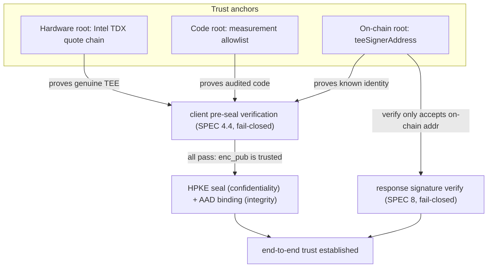
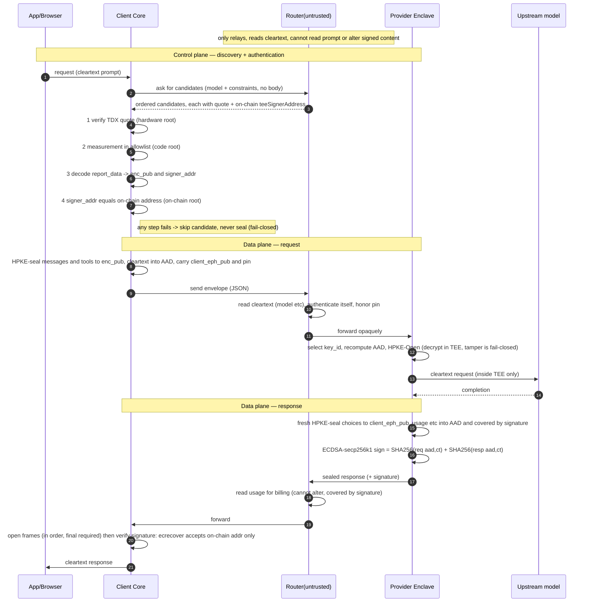

# Trust chain — how each hop is trusted

A single end-to-end picture of the 0G Private Computer E2EE path and **where the
trust of every hop bottoms out**. The normative details are spread across
[`../../protocol/SPEC.md`](../../protocol/SPEC.md) (§4.4 pre-seal checks, §5.2 AAD
integrity, §8 response signature) and [`router-e2e.md`](./router-e2e.md) (trust
boundary, limitations); this doc assembles them into one chain so a reviewer can
see there are no gaps — and where the gaps still are.

> Status: design + partial implementation. This doc marks each link as
> **implemented** or **spec'd, not yet wired** (see [Implementation status](#implementation-status)).

## The three trust roots

The whole chain hangs off three anchors. Every hop's trust traces back to one of
them — nothing is trusted "because the router said so."

| Root | What it is | What it anchors |
|------|-----------|-----------------|
| **Hardware root** | Intel TDX quote signature chain up to the Intel root | "this code really runs in a genuine TEE" |
| **Code root** | measurement allowlist | "the enclave runs the exact code I audited, not code the router swapped in" |
| **On-chain root** | on-chain `teeSignerAddress` | "this enclave is a publicly-registered, known identity — not a look-alike" |

**The router is explicitly _untrusted_.** It transports quotes, reads cleartext
routing fields, and forwards the sealed body opaquely. Every claim it makes is
either independently verified by the client against a root above, or bound by a
signature/AEAD it cannot forge.

## End-to-end sequence

## Trust per hop

| # | Hop | Threat | How trust is established | Root |
|---|-----|--------|--------------------------|------|
| 1 | Router returns candidates | Router forges/swaps a quote | Router is **not trusted**; it only relays. A forgery is caught at hop 2. | — (explicitly untrusted) |
| 2 | Verify quote authenticity | Fake TEE / software impersonating one | Quote signature chain verifies to the Intel root | Hardware |
| 3 | Measurement check | Routed to a genuine TEE running **malicious** code | Measurement must be in the audited allowlist | Code |
| 4 | Extract & bind `enc_pub` | MITM injects its own recipient key | `enc_pub` is read from the **verified quote's** `report_data`, no side channel | Hardware |
| 5 | On-chain identity check | An unknown/substituted enclave | `signer_addr` must equal on-chain `teeSignerAddress` (router cannot forge chain state) | On-chain |
| 6 | Request confidentiality | Router reads the prompt | HPKE seal to `enc_pub`; only the enclave's private key (derived in-TEE, never exported) can open | Hardware |
| 7 | Request integrity | Router downgrades `model`, inflates `max_tokens`, flips `sealed_fields`, swaps `client_eph_pub` | Every cleartext + `_e2ee` field is bound as AAD; any bound byte changed → `Open` fail-closed | AEAD |
| 8 | Enclave opens | Tampered input slips through | In-TEE checks: `keys == sealed_fields`, no collision, `signer_addr` matches | Hardware |
| 9 | Response confidentiality | Router reads the completion | Fresh HPKE seal to `client_eph_pub` | Client ephemeral key |
| 10 | Response integrity / billing | Router lies about `usage` | `usage` etc. are in the AAD **and covered by the signature**; router can read and bill but not alter | On-chain (via signature) |
| 11 | Response authenticity | Impersonating the enclave | `ecrecover` address is accepted **only if** it equals on-chain `teeSignerAddress`, never the self-reported `signing_address` | On-chain |
| 12 | Replay | Replaying an old signed proof | Per-request nonce in a sealed field; its hash is signed, so a stale proof fails the content-binding check | Client-side (server freshness still TODO) |

## Why the on-chain root exists

The quote alone proves *"a genuine TEE running audited code"* (hardware + code
roots) but says **nothing about whose enclave it is**. A malicious router can
stand up **its own** genuine TDX enclave running the exact same audited code: it
produces a perfectly valid quote, with a valid measurement, binding **its own**
`enc_pub` and `signer_addr`. Without an external identity anchor the client would
seal the prompt straight to the attacker's enclave — confidentiality holds
against the router's L7 process, but the plaintext went to the wrong operator.

The measurement answers *"is the code right?"*; the on-chain root answers *"is it
the right enclave?"* — two different questions. The chain supplies a
**router-unforgeable, globally-consistent registry** of which `teeSignerAddress`
is a legitimate provider:

- **Unforgeable**: the provider registers its address on-chain (the broker's
  `SyncQuote` path). The router only *relays* quotes — it cannot forge a chain
  record binding an address it controls to the provider identity the client
  expects.
- **Consistent view**: chain state is consensus-backed and public — the router
  cannot show the client a binding different from the one everyone else sees.
- **Narrow trust surface**: the on-chain root holds **no keys and sees no
  prompts**. The client trusts it only as a correct, tamper-evident
  `identity → address` lookup — a far weaker assumption than trusting the router.

It is anchored at two points (see [Implementation status](#implementation-status)
for the current wiring state): **hop 5** (seal the prompt only to a registered
provider) and **hop 11** (accept a response signature only from that provider's
registered address).

**In one line:** the hardware and code roots let you trust *an* enclave; the
on-chain root lets you trust *that* enclave — defeating the "real TEE, real code,
wrong operator" impersonation that an untrusted router is best positioned to
mount.

## What is *not* in the trust chain

Honest gaps — half the value of this diagram is marking them (see
[`router-e2e.md` Limitations](./router-e2e.md#limitations)):

- **Metadata leaks to the router**: `model`, coarse token counts, timing, packet
  sizes remain visible.
- **Verifiable relay, not verifiable computation**: the chain proves the enclave
  produced this exact response to this exact request; it does **not** prove the
  upstream model (`M`) behaved. The segment past hop 12 into `M` is outside the
  chain.
- **Cloud-gateway mode adds one attested trust party**: plaintext lands in 0G's
  TEE rather than the user's machine, so the gateway itself must be attested —
  otherwise it degrades to today's plaintext L7 router.
- **Replay**: defeated client-side by a per-request nonce; a server-side
  freshness field in the signed proof is still TODO.

## Implementation status

The chain is fully *specified* and now largely *wired*, including the on-chain
identity grounding (hop 5). One link is called out because the code and the spec
do not line up one-to-one — reading either alone can mislead.

| Link | Status | Where |
|------|--------|-------|
| Hop 2 — TDX quote signature-chain verification | **Implemented.** A real go-tdx-guest DCAP verifier (quote chain → Intel root + QE identity + TCB status) fills the `WithQuoteParser` seam, wired into the sidecar, gateway, and route resolver. The seam stays in `protocol/attest` by design (keeps `protocol` lean/portable); the heavy verifier lives in the client. | `client/dcap/tdxverify.go`, `client/cmd/{sidecar,gateway}/main.go`, #29 / #31 |
| Hop 3 — measurement allowlist | **Implemented, with a gap.** `Verifier.Verify` checks the measurement against `Policy` in enforce/warn modes (`-attest-enforce`). **The audited-image allowlist is still empty**, so warn mode proceeds on any measurement and enforce rejects every provider — populating the allowlist is the remaining work. | `attest/verify.go`, `client/cmd/gateway/main.go`, #31 |
| Hop 4 — `report_data` → `enc_pub`/`signer_addr` | **Implemented.** `ParseReportData` (SPEC §4.2 layout). | `attest/reportdata.go` |
| Hop 5 — `signer_addr == on-chain teeSignerAddress` | **Implemented (warn/enforce).** The route resolver cross-checks the DCAP-quote-bound signer against the provider's *acknowledged* `teeSignerAddress` read from the on-chain InferenceServing registry (`getService`), keyed on the provider's on-chain account — a mapping the untrusted router cannot forge. This is what catches a *genuine* enclave running audited code but operated by an unregistered party ([Why the on-chain root exists](#why-the-on-chain-root-exists)). Enforce skips a missing/unacknowledged/mismatched candidate; warn observes only. Reads the chain over a client-trusted RPC (`-onchain`, `-chain-rpc-url`), not the router. | `client/chain/registry.go`, `client/route` `WithOnChainVerification`, #18 |
| Hops 6–9 — HPKE seal/open, AAD binding | **Implemented.** | `crypto/`, `wire/` |
| Hop 11 — signature verify against signer | **Implemented.** Recovery + accept-only-that-address anchors on the attested signer; with `-onchain` enabled that signer is itself grounded on-chain (hop 5), so response authenticity chains to the on-chain identity. | `crypto/`, `client/chain` |

So today the chain is **closed by design and enforced end-to-end** when `-attest`
+ `-onchain` are on: the hardware, code, and on-chain roots (hops 2–5) are all
wired. The one remaining piece is *populating* the measurement allowlist (hop 3),
which is empty today — until it is filled, hop 3 runs in warn mode (or enforce
rejects all). Hop 5 turns "an attested enclave" into "the **expected** attested
enclave."
