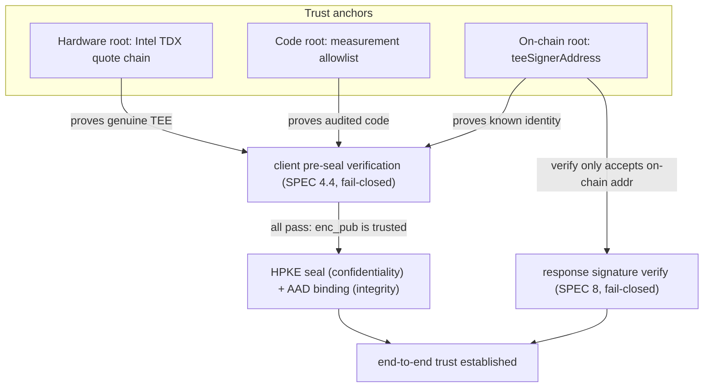
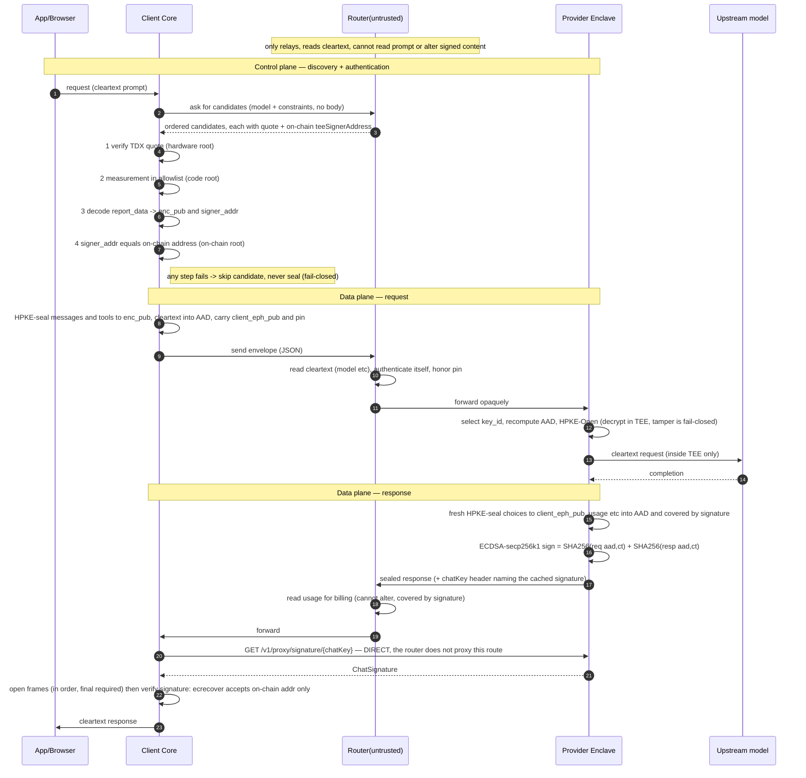

# Trust chain — how each hop is trusted

A single end-to-end picture of the 0G Private Computer E2EE path and **where the
trust of every hop bottoms out**. The normative details are spread across
[`../../protocol/SPEC.md`](../../protocol/SPEC.md) (§4.4 pre-seal checks, §5.2 AAD
integrity, §8 response signature) and [`router-e2e.md`](./router-e2e.md) (trust
boundary, limitations); this doc assembles them into one chain so a reviewer can
see there are no gaps — and where the gaps still are.

> Status: every link below is **implemented**; what differs is how far each one is
> actually carried in the deployed gateway. Four are qualified, and the qualifications are
> not the same kind:
>
> - **hop 3** (the *code root*) — the allowlist is populated
>   (`client/evidence/brokerimages.json`, one entry per audited OS image) but enforce is
>   off: it refuses an unlisted image, and providers are still running images that are
>   not listed. A deployment decision now, not a code change.
> - **hop 5** — wired and observed; its enforce switch is deliberately off.
> - **hop 11** — enforced, but only because `-verify-responses` is on; it is off by default.
> - **hop 12** — replay is defeated client-side only; a server-side freshness field is TODO.
>
> Everything else is enforced. [Implementation status](#implementation-status) has the
> per-link detail; the enforced-versus-observed split under its table is what determines
> what a request actually guarantees.

## The three trust roots

The whole chain hangs off three anchors. Every hop's trust traces back to one of
them — nothing is trusted "because the router said so."

| Root | What it is | What it anchors |
|------|-----------|-----------------|
| **Hardware root** | Intel TDX quote signature chain up to the Intel root | "this code really runs in a genuine TEE" |
| **Code root** | measurement allowlist | "the enclave runs the exact code I audited, not code the router swapped in" |
| **On-chain root** | on-chain `teeSignerAddress` | "this enclave is a publicly-registered, known identity — not a look-alike" |

**The router is explicitly _untrusted_.** It transports quotes, reads cleartext
routing fields, and forwards the sealed body opaquely. Every claim it makes is
either independently verified by the client against a root above, or bound by a
signature/AEAD it cannot forge.

## End-to-end sequence

## Trust per hop

| # | Hop | Threat | How trust is established | Root |
|---|-----|--------|--------------------------|------|
| 1 | Router returns candidates | Router forges/swaps a quote | Router is **not trusted**; it only relays. A forgery is caught at hop 2. | — (explicitly untrusted) |
| 2 | Verify quote authenticity | Fake TEE / software impersonating one | Quote signature chain verifies to the Intel root | Hardware |
| 3 | Boot-chain check | Routed to a genuine TEE running **malicious** code | The quote's boot chain (MRTD + RTMR1 + RTMR2) must be in the audited allowlist | Code |
| 4 | Extract & bind `enc_pub` | MITM injects its own recipient key | `enc_pub` is read from the **verified quote's** `report_data`, no side channel | Hardware |
| 5 | On-chain identity check | An unknown/substituted enclave | `signer_addr` must equal on-chain `teeSignerAddress` (router cannot forge chain state) | On-chain |
| 6 | Request confidentiality | Router reads the prompt | HPKE seal to `enc_pub`; only the enclave's private key (derived in-TEE, never exported) can open | Hardware |
| 7 | Request integrity | Router downgrades `model`, inflates `max_tokens`, flips `sealed_fields`, swaps `client_eph_pub` | Every cleartext + `_e2ee` field is bound as AAD; any bound byte changed → `Open` fail-closed | AEAD |
| 8 | Enclave opens | Tampered input slips through | In-TEE checks: `keys == sealed_fields`, no collision, `signer_addr` matches | Hardware |
| 9 | Response confidentiality | Router reads the completion | Fresh HPKE seal to `client_eph_pub` | Client ephemeral key |
| 10 | Response integrity / billing | Router lies about `usage` | `usage` etc. are in the AAD **and covered by the signature**; router can read and bill but not alter | On-chain (via signature) |
| 11 | Response authenticity | Impersonating the enclave | `ecrecover` address is accepted **only if** it equals on-chain `teeSignerAddress`, never the self-reported `signing_address` | On-chain |
| 12 | Replay | Replaying an old signed proof | Per-request nonce in a sealed field; its hash is signed, so a stale proof fails the content-binding check | Client-side (server freshness still TODO) |

## Why the on-chain root exists

The quote alone proves *"a genuine TEE running audited code"* (hardware + code
roots) but says **nothing about whose enclave it is**. A malicious router can
stand up **its own** genuine TDX enclave running the exact same audited code: it
produces a perfectly valid quote, with a valid measurement, binding **its own**
`enc_pub` and `signer_addr`. Without an external identity anchor the client would
seal the prompt straight to the attacker's enclave — confidentiality holds
against the router's L7 process, but the plaintext went to the wrong operator.

The measurement answers *"is the code right?"*; the on-chain root answers *"is it
the right enclave?"* — two different questions. The chain supplies a
**router-unforgeable, globally-consistent registry** of which `teeSignerAddress`
is a legitimate provider:

- **Unforgeable**: the provider registers its address on-chain (the broker's
  `SyncQuote` path). The router only *relays* quotes — it cannot forge a chain
  record binding an address it controls to the provider identity the client
  expects.
- **Consistent view**: chain state is consensus-backed and public — the router
  cannot show the client a binding different from the one everyone else sees.
- **Narrow trust surface**: the on-chain root holds **no keys and sees no
  prompts**. The client trusts it only as a correct, tamper-evident
  `identity → address` lookup — a far weaker assumption than trusting the router.

It is anchored at two points (see [Implementation status](#implementation-status)
for the current wiring state): **hop 5** (seal the prompt only to a registered
provider) and **hop 11** (accept a response signature only from that provider's
registered address).

**In one line:** the hardware and code roots let you trust *an* enclave; the
on-chain root lets you trust *that* enclave — defeating the "real TEE, real code,
wrong operator" impersonation that an untrusted router is best positioned to
mount.

### What hop 5 concludes, and what it does not

Hop 5 compares two independently-cached readings — the quote-bound signer and the
chain's acknowledged `teeSignerAddress` — so a negative can be about either the
provider or the *readings*. Two rules follow, both enforced in `client/route`:

- **A failed lookup is not a verdict, and not a pass.** Under `-onchain-enforce` an
  unreadable chain fails the candidate, so enforce means the chain was actually
  read; but it is counted as its own class, never as a `mismatch`, so a problem with
  our own RPC never reads as an accusation against a provider. There is deliberately
  no switch to proceed ungrounded: a check an adversary can turn off by degrading
  one RPC endpoint is not one anything may call proven.
- **Cached evidence may confirm, never condemn.** A cached reading that agrees with
  the quote is accepted; one that disagrees is re-read live before any rejection,
  on either side of the comparison. The reason is the rotation window in
  [What is *not* in the trust chain](#what-is-not-in-the-trust-chain), not
  fastidiousness.

The consequence for the layers above: under enforce, grounding cannot silently
lapse, so a panel labelling the provider address *proven* can say so from the mode
alone rather than carrying a per-request grounding flag.

Operating it — the metrics to watch before enabling enforce, and the caches and
backoffs that keep the strict default affordable — is in
[`deploy/phala/README.md`](../../deploy/phala/README.md) and
[`deploy/grafana/README.md`](../../deploy/grafana/README.md).

## What is *not* in the trust chain

Honest gaps — half the value of this diagram is marking them (see
[`router-e2e.md` Limitations](./router-e2e.md#limitations)):

- **A signer rotation cannot be expressed atomically.** The registry holds exactly
  one `teeSignerAddress` and one `teeSignerAcknowledged` flag per provider, so it
  cannot say "old and new are both valid for the next few minutes". A broker upgrade
  rotates `enc_pub` and `signer_addr` together (both out of one `report_data`, so
  they never split), which means that during any rollout the chain and the quote
  name different signers for a while — in whichever order the operator does it. The
  resolver narrows the window by re-reading live rather than ruling on a cached
  reading, but it cannot close it: what remains is a deployment-ordering concern,
  and the runbook is in [`deploy/phala/README.md`](../../deploy/phala/README.md).

- **Metadata leaks to the router**: `model`, timing and packet sizes remain
  visible — and token usage **exactly**, not approximately: [`SPEC.md` §7](../../protocol/SPEC.md#7-sealed-response-envelope-v1)
  leaves `usage` cleartext so the router can bill on it. Sizes are exact for the
  same kind of reason: ChaCha20-Poly1305 adds a 16-byte tag and no padding, so a
  ciphertext's length is its plaintext's length plus a constant. On a stream,
  per-frame timing is visible too. What the router cannot do is *alter* any of
  it — `usage` is in the AAD and covered by the §8 signature, so it reads and
  bills but cannot forge (hop 10).
- **Verifiable relay, not verifiable computation**: the chain proves the enclave
  produced this exact response to this exact request; it does **not** prove the
  upstream model (`M`) behaved. The segment past hop 12 into `M` is outside the
  chain.
- **Cloud-gateway mode adds one attested trust party**: plaintext lands in 0G's
  TEE rather than the user's machine, so the gateway itself must be attested —
  otherwise it degrades to today's plaintext L7 router. That attestation is a
  separate artifact from this chain and is checked separately
  (`pcverify -gateway`, below), including code identity: the OS-image allowlist that
  grounds it is populated for the deployed image, so that link is closed for the images
  listed, and an unlisted one fails rather than being skipped.
- **Replay**: defeated client-side by a per-request nonce; a server-side
  freshness field in the signed proof is still TODO.

## Implementation status

The chain is fully *specified* and wired, including the on-chain identity grounding
(hop 5). Read the Status note above for which links are enforced and which only observed:
the table below says what exists, not how far the deployment carries it, and hop 3 in
particular has its allowlist while its enforce switch waits on the fleet.

| Link | Status | Where |
|------|--------|-------|
| Hop 2 — TDX quote signature-chain verification | **Implemented.** A real go-tdx-guest DCAP verifier (quote chain → Intel root + QE identity + TCB status) fills the `WithQuoteParser` seam, wired into the sidecar, gateway, and route resolver. The seam stays in `protocol/attest` by design (keeps `protocol` lean/portable); the heavy verifier lives in the client. | `client/dcap/tdxverify.go`, `client/cmd/{sidecar,gateway}/main.go`, #29 / #31 |
| Hop 3 — boot-chain allowlist | **Implemented, allowlist populated.** `Verifier.Verify` compares the quote's `BootChain` (MRTD + RTMR1 + RTMR2) against `BootChainPolicy` in enforce/warn modes (`-attest-enforce`). The expected values are **published as an embedded file in this repository** — `client/evidence/brokerimages.json`, one entry per audited OS image, beside the gateway's own `osimages.json` — which answers what used to be the open half of this hop. Each entry records the release it was computed from with `dstack-mr` and confirmed against a live quote; an entry that cannot say that is refused in review. `-attest-enforce` is still off in deployment, not for want of a mechanism but because providers are still running images that are not listed, and enforce refuses those. | `attest/verify.go`, `attest/measurement.go`, `client/evidence/brokerimage.go`, #31 |
| Hop 4 — `report_data` → `enc_pub`/`signer_addr` | **Implemented.** `ParseReportData` (SPEC §4.2 layout). | `attest/reportdata.go` |
| Hop 5 — `signer_addr == on-chain teeSignerAddress` | **Implemented (warn/enforce).** The route resolver cross-checks the DCAP-quote-bound signer against the provider's *acknowledged* `teeSignerAddress` read from the on-chain InferenceServing registry (`getService`), keyed on the provider's on-chain account — a mapping the untrusted router cannot forge. This is what catches a *genuine* enclave running audited code but operated by an unregistered party ([Why the on-chain root exists](#why-the-on-chain-root-exists)). Enforce skips a missing/unacknowledged/mismatched candidate; warn observes only. A failed *lookup* is fail-closed too, with no opt-out — so enforce means the chain was actually read — but is counted as its own class rather than as a provider accusation; and a negative is never returned on stale or cached evidence without a live re-read ([What hop 5 concludes, and what it does not](#what-hop-5-concludes-and-what-it-does-not)). Reads the chain over a client-trusted RPC (`-onchain`, `-chain-rpc-url`), not the router. | `client/chain/registry.go`, `client/route` `WithOnChainVerification`, #18 |
| Hops 6–9 — HPKE seal/open, AAD binding | **Implemented.** | `crypto/`, `wire/` |
| Hop 11 — signature verify against signer | **Implemented (opt-in, `-verify-responses`).** The client recomputes the §8 ciphertext binding over the on-wire `aad‖ciphertext` it received (non-stream, and streamed via an ordered per-frame aggregate), recovers the EIP-191 signer, and accepts only if it equals `provider.SignerAddr` — the quote-bound signer, itself grounded on-chain when `-onchain` is on (hop 5) — never the self-reported `signing_address`. The signature is fetched **directly from the provider's broker endpoint** (the router does not proxy `/v1/proxy/signature`). Fail-closed; off by default. The versioned signed-text/binding contract is shared with the broker in `protocol/proof` (no drift). | `protocol/proof`, `client/sig`, `client/core` (verify.go), `client/route` (sigfetch.go) |

So today every link is **wired**, but they are not all **enforced**, and the difference
matters:

- **Enforced** — hop 2 (quote authenticity, with `-attest`), hop 4 (`report_data` →
  `enc_pub`), hops 6–9 (seal/open and AAD binding), and hop 11 (the §8 response
  signature, with `-verify-responses`; fail-closed by construction). A candidate or a
  response that fails any of these is refused.
- **Warn only** — hop 3, because the fleet is not yet all on listed images: the
  allowlist exists and is populated, but enforce refuses an unlisted image, so
  `-attest-enforce` stays off until the providers being routed to are on entries the
  build carries. And hop 5, whose
  `-onchain-enforce` is deliberately off while on-chain provider data is still filling
  in; it is wired and observed, and turning it on is a switch rather than work.

So the **code root is the one root not yet doing its job** — hop 3 is exactly that root.
Hop 5, once enforced, is what turns "an attested enclave" into "the **expected** attested
enclave."

Hop 3 is no longer blocked on either. Its allowlist takes one entry per OS image
(`attest.BootChain`), computable from a published release before any deployment exists,
and the values are published as `client/evidence/brokerimages.json` — embedded, so a
verifier needs no configuration and cannot be pointed at a friendlier list by accident.
Publishing them on-chain beside the provider registry, or as broker release assets,
remains possible later; embedding them beside the gateway's own allowlist was the
smaller step and the same trust argument. What is blocked now is only the deployment
decision: enforce refuses an unlisted image, so it waits on the fleet, not on us.

> **Why the allowlist stayed empty, and what changed.** It used to compare the full
> `Measurement` — all five registers, including **RTMR3**. In dstack, RTMR3 is where
> per-app *and per-instance* runtime events land, including `instance_id`, derived from
> a random seed at first boot (`Sha256(seed ‖ app_id)`). So RTMR3 differs between two
> replicas of the *same* deployment, and a full-equality entry pinned **one instance**,
> not one audited version: an allowlist of that shape needed a new entry per CVM rather
> than per upgrade, and could never be published ahead of a deployment. It was
> unfillable, not merely unfilled.
>
> `Verifier` now uses the same split the gateway already made (`attest.BootChain` +
> `BootChainPolicy`): pin **MRTD + RTMR1 + RTMR2** for the OS image, and leave the
> application to its compose hash. Two questions with two lifetimes, so two mechanisms.
> **RTMR0 is excluded too**, because it records the VM shape (vCPU count, memory,
> ACPI/device layout), which this check does not need to establish — the code performing
> the boot-time binding check lives in the firmware, kernel and rootfs, which the three
> registers above measure. Including it would have cost an entry per (image, VM shape)
> pair for no gain.
>
> So the allowlist is **one entry per image**, computed with `dstack-mr` from the
> published release and confirmed against a live quote — never copied off a running
> machine. `attest.Policy` remains only as a deprecated type, documenting why the
> obvious shape does not work.
>
> One half is still missing: pinning the application by compose hash needs the quote's
> `mr_config_id`, which the `quoteParser` seam does not return, so the provider path
> cannot do it yet. The gateway pins it separately (`client/evidence`). And where the
> expected values are *published* remains open: on-chain alongside the provider
> registry, or as release assets of the broker repo (which `pcverify` could consume
> with the same machinery `-releases` already uses for the gateway).

**Checking a provider (`client/cmd/pcverify -provider`).** A read-only diagnostic
walks hops 2–5 for one provider in a single command — DCAP-verify its quote
(genuine TDX + measurement + report_data) and cross-check the quote-bound signer
against its acknowledged on-chain `teeSignerAddress`. Use it as the pre-enable gate
before flipping the sidecar/gateway into `-attest` / `-onchain`. The provider's
endpoint is read from the chain (`Service.url`), so only `-provider` is required.
`-no-quote` restricts the run to the on-chain hop.

**Checking the gateway itself (`pcverify -gateway <domain>`).** The chain above
covers the *provider* hop; in cloud-gateway mode there is one more attested party
in front of it, and it is not on this chain — the gateway emits no quote and signs
no responses. Its identity rests on the dstack-ingress cert-binding quote at
`/evidences/` ([`cloud-gateway.md` §6.1](./cloud-gateway.md#61-mechanism)), which
the gateway mode verifies: bundle integrity against its own `sha256sum.txt`, DCAP
verification of `quote.json`, the `report_data` → manifest binding, and — the step
that actually ties the quote to the endpoint you are talking to — the **served**
certificate compared against the bundle's.

It also covers **code identity**, which the provider chain's hop 3 does for the
broker but which the gateway needs separately: the verified quote's `mr_config_id`
carries `compose_hash = SHA-256(app-compose.json)` in the clear. The app-compose bytes
are then located without anything being typed in — the platform base domain from the
served domain's CNAME chain, the `app_id` from the quote itself (`-base-domain`
overrides the former, `-app-compose` supplies the bytes from a file instead) — and the
hash is what makes any source acceptable. The tool authenticates them against
`compose_hash` before reading them, then compares the `docker_compose_file` they embed
against the manifest that was published (`-expect-compose-file`, or by default the
newest published releases).

Underneath that sits the **gateway CVM's own OS image**, which plays the role hop 3
plays for the broker. `mr_config_id` is written by the untrusted host; the compose hash
is truthful only because the guest OS refuses to boot when that register disagrees with
the app-compose actually delivered, so the OS doing that check is part of the chain. The
tool compares the quote's image registers — `MRTD` + `RTMR1` + `RTMR2`, excluding
`RTMR3` (the compose hash already pins the app, more precisely) and `RTMR0` (the VM
shape, which this check does not need) — against an allowlist embedded in the binary
(`client/evidence/osimages.json`). **That allowlist is populated** for the image the
gateway is deployed on: the three values were computed with `dstack-mr` from the
published guest-OS release whose `digest.txt` equals the CVM's `os_image_hash`, and then
confirmed to equal what a live quote reports. So the step checks rather than reports, and
an image that is not listed FAILS — a new OS image version needs an entry before it is
deployed. Hop 3's broker allowlist is a separate, still-open task — it now uses the same
mechanism, and what it lacks is values and a place to publish them.

Two further limits are worth stating: the compose hash is only as strong as the image
pinning inside the compose text — a floating tag keeps it stable while the code changes
— and waiving chain trust (`-allow-untrusted-cert`) drops the link between the
connection and the domain, so an interceptor with its own attested CVM would satisfy
everything else.
