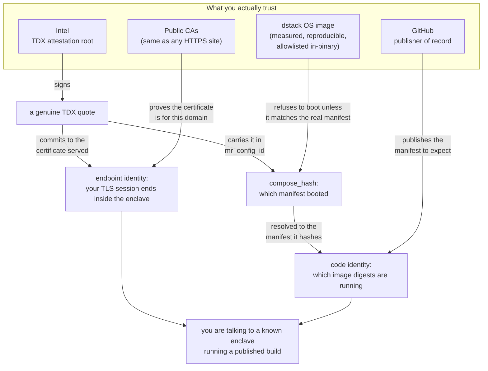
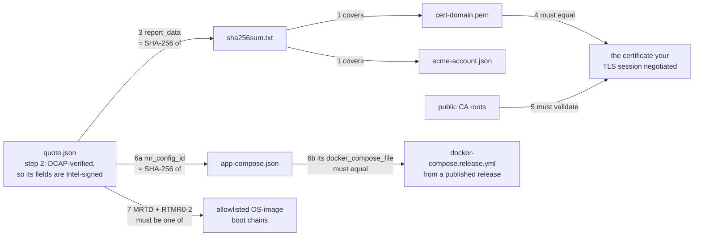

# Verifying the 0G Private Computer gateway

You are about to send prompts to `https://<gateway-domain>`. This document is how
you check, for yourself, that the thing answering is a genuine confidential-computing
enclave running code you can read — instead of taking our word for it.

Everything here is independently checkable. Nothing in it requires trusting 0G, and
the one command below is a convenience, not the source of truth: the
[manual procedure](#doing-it-by-hand) uses only `curl`, `openssl`, `jq` and
`sha256sum`.

> **Scope.** This document covers the **gateway** — the 0G-operated enclave that
> takes your request and seals it to a provider. Verifying the *provider* that runs
> the model is a separate chain, documented in
> [`design/trust-chain.md`](./design/trust-chain.md); the gateway performs those
> checks on your behalf per request.

---

## The one command

```sh
pcverify -gateway <gateway-domain>
```

Exit code 0 means every check below passed. Non-zero means one did not, and the
output names which. There is nothing to configure: the tool discovers what it needs
from the endpoint itself and from public sources.

Digests below are abbreviated with `…` for readability; a real run prints them in
full. This is what a pass looks like on today's builds:

```
expected compose   newest 5 release(s) of 0gfoundation/0g-pc-e2ee (docker-compose.release.yml)
gateway            pc-gateway.0g.ai
✓   acme-account.json              0443a4bf…
✓   cert-pc-gateway.0g.ai.pem      36024092…
✓ evidence bundle    2 file(s) match sha256sum.txt
✓ quote              genuine TDX (DCAP verified)
✓ bundle binding     report_data == SHA-256(sha256sum.txt)
✓ endpoint binding   served certificate is the one the quote binds
  served cert      46d34704…
  subject          CN=pc-gateway.0g.ai
  issuer           CN=E5,O=Let's Encrypt,C=US
  not after        2026-11-05T14:35:22Z
✓ chain trust        validates for pc-gateway.0g.ai
✓ compose_hash       55d872aa…
  app_id           55d872aaa9c0b148228ebcf89302a52e7cd3d252
✓ app-compose        sha256 == compose_hash (authenticated)
  source           55d872aaa9c0b148228ebcf89302a52e7cd3d252-8090.in1.phala.network
  app name         0g-pc-gateway-a-1
  allowed_envs     ZG_GATEWAY_ROUTER_URL DOMAIN GATEWAY_DOMAIN …
✓ compose file       matches release-2026.08.07.1 byte-for-byte
- os image           not pinned (allowlist is empty; see client/evidence/osimages.json)
  observed mrtd   b24d3b24…
  observed rtmr0  01361d27…
  observed rtmr1  6e1afb74…
  observed rtmr2  89e73ced…

note: code identity is only as strong as the image pinning inside the compose text —
a floating tag keeps compose_hash stable while the code changes; the OS image is NOT
pinned (the allowlist is empty), so nothing establishes that the guest enforced the
compose-hash binding — treat code identity as strong evidence, not proof. Endpoint
identity is unaffected

PASS
```

The `-` on `os image` is the one step that does not check anything yet, and the
closing `note` says so on every run — see [Current limits](#current-limits). Once the
allowlist is populated that line becomes a name, e.g.
`✓ os image  dstack-nvidia-0.5.4.1 (1 vCPU / 2 GiB / 0 GPU)`, and the note drops the
OS-image caveat. The four `observed` registers are printed precisely because they are
what an auditor records while the step is unpinned.

---

## What the checks establish

Two separate questions, answered by two separate mechanisms.

**Endpoint identity** — *is the thing I am talking to a genuine enclave?* The
enclave generates its own TLS private key inside the CVM, obtains a certificate for
the domain, and commits to that certificate inside a hardware-signed attestation
quote. If the certificate your browser or SDK negotiated is the one the quote
commits to, then your TLS session terminates **inside** that enclave. Nobody
outside it — including 0G's own operators and the cloud host — holds the key.

**Code identity** — *what is running in there?* The same quote commits to a hash of
the CVM's deployment manifest, which embeds the container images by digest. Resolve
that hash and you know exactly which build is serving you, and can compare it
against the manifests published in this repository's releases.



Note what is **not** in that box: not 0G, not the cloud provider hosting the
enclave, not DNS, and not the API that hands out the manifest. The
[trust assumptions](#trust-assumptions-stated-plainly) section explains why each of
those is not load-bearing.

---

## The checks, one at a time

The enclave publishes an *evidence bundle* at `https://<domain>/evidences/`:

| File | What it is |
|------|-----------|
| `quote.json` | the hardware attestation quote |
| `sha256sum.txt` | digests of every other file in the bundle |
| `cert-<domain>.pem` | the certificate chain the enclave obtained |
| `acme-account.json` | the ACME account the certificate was issued under |



**1. Bundle integrity.** Every file in the bundle matches the digest
`sha256sum.txt` records for it. This is `sha256sum -c`. On its own it proves
nothing — the whole bundle could be fabricated — but it makes the next step cover
all of it at once.

**2. Quote authenticity.** `quote.json` is DCAP-verified: its signature chains up to
Intel's attestation root, the quoting enclave's identity is checked, and the
platform's TCB status must be current. This is what makes the quote's contents
mean "a real Intel TDX enclave said this" rather than "a JSON file claims this".
*Skip it and everything below is unfounded.*

**3. Bundle binding.** The quote's `report_data` field must equal
`SHA-256(sha256sum.txt)`. `report_data` is chosen by the enclave when it requests
the quote, so this is the enclave saying, under Intel's signature: *these exact
bundle files are mine.* Combined with step 1, the quote now covers the certificate.

**4. Endpoint binding.** We open our own TLS connection to the domain and compare
the certificate we are served against the one in the bundle. **This is the
load-bearing step.** Skip it and the quote proves only that *some* enclave
somewhere obtained *some* certificate — it says nothing about the endpoint in front
of you, and anyone could republish a genuine bundle they downloaded from elsewhere.

**5. Chain trust.** The served certificate must validate for the domain against the
public CA roots, exactly as your browser would check it. This ties the connection to
the *name* you asked for. Without it, someone who can intercept your traffic and
runs their own enclave would satisfy every other check — their own quote, their own
consistent bundle, their own certificate matching it, because they control both.

**6. Code identity.** The quote's `mr_config_id` register carries
`compose_hash` — the SHA-256 of the CVM's `app-compose.json`, the manifest that
embeds the `docker-compose` text verbatim. So the quote commits to the deployment
configuration, and therefore to the container image digests. Fetch that manifest
from anywhere, confirm its digest is the one the quote names, and read the image
digests out of it. Then compare the embedded compose text against the
`docker-compose.release.yml` published in this repository's releases — the tool does
this against the newest 5 by default and reports **which** release is live.

> `mr_config_id` is part of the signed hardware report, so recovering `compose_hash`
> needs no replay of any log and no cooperation from anyone. `app_id`, the identifier
> the hosting platform labels the deployment by, is simply its first 20 bytes.

**7. OS image.** `mr_config_id` is supplied by the (untrusted) host when the enclave
is built, so step 6 needs one more thing to stand up: the guest OS inside the enclave
reads its own quote at boot, compares `mr_config_id` against the manifest it actually
received, and **refuses to boot on a mismatch**. Trusting that means trusting the code
doing it — which is what the quote's `MRTD` and `RTMR0`–`RTMR2` boot-chain
measurements record. The tool compares them against an allowlist built into the
binary, so nobody has to supply a value; see [current limits](#current-limits) for
whether the deployment you are checking is covered yet.

`RTMR3` is deliberately *not* pinned: it carries the per-application and
per-instance runtime events, so it legitimately differs between two deployments of
the same OS. The application is already pinned, more precisely, by step 6.

> An allowlist entry is an **(image, VM shape)** pair, not an image. `MRTD` and
> `RTMR0`–`RTMR2` are a function of the image *and* the VM it booted on — vCPU count,
> RAM size, PCI topology, GPU count — which is why dstack publishes reproducible build
> material rather than a table of measurements.

---

## Trust assumptions, stated plainly

**Intel.** The attestation root. If Intel's signing infrastructure is compromised or
TDX is broken, this collapses — as does every other confidential-computing claim.
This is the irreducible assumption.

**The dstack OS image.** Step 7 above. What you are trusting is that the boot-chain
measurements in the allowlist really are the audited dstack OS — and that is checkable
rather than asserted: they are recomputed from dstack's reproducible build with
`dstack-mr`, and [`client/evidence/osimages.json`](../client/evidence/osimages.json)
records, for each entry, the image and VM shape it was derived for. Reviewing what this
tool accepts is reviewing that file.

**GitHub, as publisher of record.** Comparing against "the manifests we published"
means someone must be the publisher. A tampered release asset causes a *mismatch*,
never a false pass, because it is only ever compared against text the quote already
authenticated. You can substitute your own copy with `-expect-compose-file`.

**Public CAs.** Step 5 is ordinary web PKI, the same assumption you make visiting any
HTTPS site.

### What you do *not* have to trust

**0G.** Every check above is over artifacts you fetch yourself, verified against
Intel's signature and public releases. We cannot make a failing deployment pass. The
verification tool is in this repository and the [manual procedure](#doing-it-by-hand)
avoids it entirely.

**The cloud provider hosting the enclave.** It is the untrusted host in the TDX
model. It cannot read enclave memory, cannot extract the TLS key, and cannot forge a
quote. It *can* refuse to serve you — availability is not protected — and it decides
which OS image boots, which is why the OS measurement matters.

**The API that hands out `app-compose.json`.** This surprises people, so it is worth
being precise: that fetch is a **hash preimage lookup**, not testimony. The quote
already told you the digest. If the API returns the wrong bytes, the digest does not
match and the check fails; if it returns the right bytes, you have learned the truth —
not because the API was honest, but because SHA-256 is collision-resistant. This is
why the manifest may come from anywhere: the platform, a mirror, an operator's
records, or a hostile party.

**DNS.** Used only to *locate* things: which platform host to ask for the manifest.
A wrong or hijacked answer produces a failed lookup or a failed digest comparison,
never a false pass. The deployment's identity is never taken from DNS — it comes from
the quote.

---

## Current limits

Read this section before relying on a `PASS`.

**The OS-image allowlist is not populated yet.** Step 7 is implemented and runs
automatically, but
[`client/evidence/osimages.json`](../client/evidence/osimages.json) currently ships
empty, so on today's builds the step reports `- os image  not pinned` rather than
checking anything. While that is the case, a host that booted a *modified* dstack OS —
one with the `mr_config_id` check removed — could commit to a published release's
`compose_hash` while running something else, and the run would still report `PASS`.
**Treat code identity as "strong evidence, not proof" until the allowlist is
populated.** Endpoint identity (steps 1–5) is unaffected either way, and the run says
which case you are in — both on the `os image` line and in its closing note.

**A run covers the connection it made, and a domain may be served by several
enclaves.** One `app_id` can be backed by more than one CVM for capacity and
failover, and the platform picks one **per TCP connection** (a connect race, not
round-robin — see [`../deploy/phala/blue-green.md`](../deploy/phala/blue-green.md#scaling-one-side-replicas)).
Each of those CVMs generates its **own** TLS key inside itself and gets its **own**
certificate, so:

- the `served cert` digest can legitimately differ between two runs, and between a
  run and what your browser shows — that is a different replica, not a failure;
- `compose_hash` / `app_id` must **not** differ, because replicas are grouped *by*
  `app_id`. Code identity therefore generalizes across replicas; endpoint identity
  does not — it is established for the connection that was checked.

If you want coverage of more than one replica, run the check again (a fresh
connection may land elsewhere); every response also carries `X-0G-Gateway-Instance`
naming the replica that served it.

**Code identity is only as strong as the pinning in the manifest.** An image
referenced by a mutable tag rather than a digest keeps `compose_hash` identical while
the code behind the tag changes. Check that the compose text you read pins digests
(`image: …@sha256:…`), not tags.

**The gateway sees your prompt in plaintext.** That is what it is for: it seals your
request to the provider enclave on your behalf. So the gateway is a second enclave
that handles cleartext, versus one for a client that seals directly. Sealing on your
own machine is what the sidecar and in-process SDK forms exist for
([`../client/README.md`](../client/README.md)), but neither is currently offered as a
supported entry point — so if a second cleartext enclave is unacceptable for your use
case, the hosted gateway is not the right form for you today.

**Metadata is visible to the router.** Model name, approximate token counts, timing
and packet sizes are not hidden.

**Detection, not prevention.** These checks tell you whether a deployment *is* what it
claims. They do not stop a bad deployment from existing — they make it detectable by
anyone who looks. If you never run them, you are trusting by default.

**Availability is not attested.** Nothing here prevents the endpoint from being taken
offline.

---

## Doing it by hand

If you would rather not run our binary, the whole procedure is four tools. `DOMAIN`
is the gateway; the checks are numbered as above.

```bash
DOMAIN=pc-gateway.0g.ai

# --- 1. bundle integrity ---
for f in quote.json sha256sum.txt acme-account.json "cert-$DOMAIN.pem"; do
  curl -sO "https://$DOMAIN/evidences/$f"
done
sha256sum -c sha256sum.txt          # every listed file must be OK

# --- 4. endpoint binding: the cert you are served vs the cert in the bundle ---
openssl s_client -servername "$DOMAIN" -connect "$DOMAIN:443" </dev/null 2>/dev/null \
  | openssl x509 -outform pem > served.pem
diff <(openssl x509 -in served.pem -noout -pubkey) \
     <(openssl x509 -in "cert-$DOMAIN.pem" -noout -pubkey) \
  && echo "served certificate is the one in the bundle"

# --- 5. chain trust ---
openssl s_client -servername "$DOMAIN" -connect "$DOMAIN:443" -verify_return_error \
  </dev/null >/dev/null && echo "certificate validates for $DOMAIN"

# --- 3. bundle binding ---
sha256sum sha256sum.txt             # must equal the first 32 bytes of report_data
```

Step **2** — DCAP-verifying `quote.json` — needs a quote verifier;
[`dcap-qvl`](https://github.com/Phala-Network/dcap-qvl) or Intel's own QVL will do.
Take `report_data` and `mr_config_id` **from the verified quote body**, not from the
convenience fields alongside it in `quote.json`: those are unsigned copies, and using
them would make the whole exercise circular. In the verified body, `report_data` is
`SHA-256(sha256sum.txt)` followed by 32 zero bytes, and `mr_config_id` is `0x01`, the
32-byte `compose_hash`, then zero padding.

```bash
# --- 6. code identity ---
APP=<first 20 bytes of compose_hash, as hex>    # from the verified quote
curl -s "https://$APP-8090.<platform-base-domain>/prpc/Info" > info.json
jq -r '.tcb_info' info.json > tcb.json
jq -j '.app_compose' tcb.json > app-compose.json    # -j: no trailing newline

# the digest must be the compose_hash the quote committed to — THIS is the step
# that makes the bytes above trustworthy, whatever their source
sha256sum app-compose.json

# then read out the deployment manifest and compare it with a published release
jq -j '.docker_compose_file' app-compose.json > deployed-compose.yml
diff deployed-compose.yml docker-compose.release.yml
```

The platform base domain is the end of the served domain's CNAME chain
(`dig +short CNAME` repeatedly; it ends at `_.<base-domain>`).

Step **7** — the OS image — is the one part that needs the image itself. Recompute the
expected boot chain from dstack's reproducible build and compare it with the verified
quote's registers:

```bash
cargo build --release -p dstack-mr-cli   # from github.com/Dstack-TEE/dstack
dstack-mr diagnose --vm-config vm-config.json --image-dir <image> \
  --actual-mrtd <hex> --actual-rtmr0 <hex> --actual-rtmr1 <hex> --actual-rtmr2 <hex>
```

`vm-config.json` is the `vm_config` the CVM reports. A mismatch is reported per RTMR0
event, so it points at what diverged rather than just saying no. The values this tool
accepts are in
[`client/evidence/osimages.json`](../client/evidence/osimages.json) — reviewing that
file is reviewing what it will call acceptable.

Release manifests are the `docker-compose.release.yml` asset on
<https://github.com/0gfoundation/0g-pc-e2ee/releases>.

---

## If a check fails

| Symptom | Most likely cause |
|---|---|
| `sha256sum -c` mismatch | the bundle was modified after it was hashed, or is being served by something other than the enclave |
| quote fails DCAP verification | not a genuine TDX quote, or the platform's TCB is out of date |
| `report_data` does not match the manifest digest | the quote belongs to a different bundle — often a stale quote republished beside regenerated evidence |
| served certificate is not the one in the bundle | you are not talking to the enclave the bundle came from, **or** the certificate was renewed and the evidence was not regenerated (the tool distinguishes these: a renewal keeps the same public key) |
| certificate does not validate | ordinary TLS failure, an interception, or a deliberately untrusted staging certificate |
| `app-compose` digest does not match `compose_hash` | the manifest is for a different deployment or instance — under blue/green, most often the standby side rather than the live one |
| compose text matches no published release | **the finding that matters.** The deployment is running something that was not published. Report it. |
| `os image` matches no allowlisted image | either the deployment was upgraded to an OS this tool does not know yet, or it is not running the OS it should be. The observed registers are printed so the two can be told apart against the reproducible build. |

Anything that is not a clean pass is worth reporting: open an issue at
<https://github.com/0gfoundation/0g-pc-e2ee/issues>.

---

## Further reading

- [`design/cloud-gateway.md`](./design/cloud-gateway.md) — the gateway's design, its
  trust model, and why it emits no attestation quote of its own
- [`design/trust-chain.md`](./design/trust-chain.md) — the provider-side chain the
  gateway verifies per request on your behalf
- [`../protocol/SPEC.md`](../protocol/SPEC.md) — the normative wire format: how
  requests are sealed and responses proven
- [`../deploy/phala/README.md`](../deploy/phala/README.md) — how the gateway is
  deployed, from the operator's side
