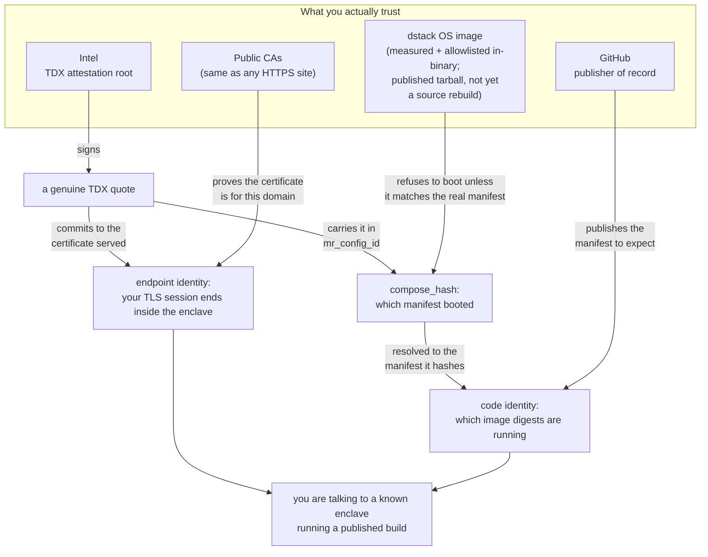
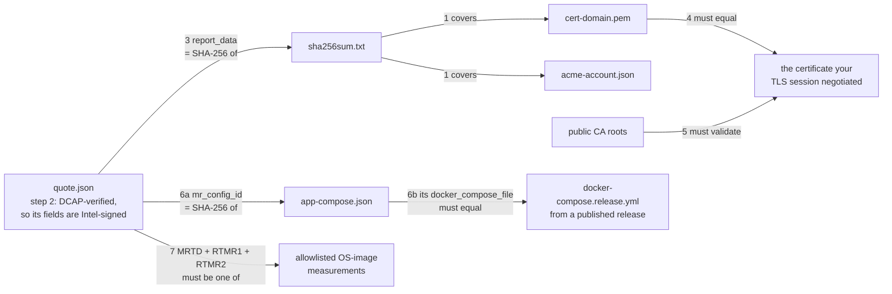

# Verifying the 0G Private Computer gateway

You are about to send prompts to `https://<gateway-domain>`. This document is how
you check, for yourself, that the thing answering is a genuine confidential-computing
enclave running code you can read — instead of taking our word for it.

Everything here is independently checkable, and none of it requires trusting 0G. The one
command below is a convenience, not the source of truth — the
[manual procedure](#doing-it-by-hand) reaches the same conclusions with standard tools.

> **This document is the procedure.** If you came here asking *why* the product is
> private rather than *how to check it*, start with
> [`why-this-is-private.md`](./why-this-is-private.md) ([中文](./why-this-is-private.zh-CN.md))
> — the same claims in three paragraphs, with what is and is not hidden, and no tooling
> to install.

> **Scope.** This document covers the **gateway** — the 0G-operated enclave that takes
> your request and seals it to a provider. The gateway verifies the *provider* on your
> behalf per request: two of those checks **reject** (a provider whose TDX quote does not
> DCAP-verify is not used, a response whose TEE signature does not verify is not returned
> to you) and two currently only **warn**. That is a separate chain, and
> [`design/trust-chain.md`](./design/trust-chain.md) marks the status of each of its links.

---

## The one command

```sh
pcverify -gateway <gateway-domain>
```

**Getting `pcverify`.** There is no published binary — build it from the source you are
about to rely on:

```sh
git clone https://github.com/0gfoundation/0g-pc-e2ee
cd 0g-pc-e2ee/client
go build -o pcverify ./cmd/pcverify     # or: go run ./cmd/pcverify -gateway <domain>
```

(`go install …/cmd/pcverify@latest` does **not** work: `client/go.mod` carries a
`replace` for the in-repo `protocol` module, which `go install` refuses. Clone and
build.)

**Read the exit code, and read which one.** Two lookups are *advisory by default*,
because they reach things that say nothing about the deployment: the release lookup
reaches GitHub, and locating the app-compose reaches DNS and the platform. A run where
one of those is unavailable failed nothing, but it also did not check everything, and
those are different claims:

| Exit | Means |
|---|---|
| `0` | every check ran and passed |
| `1` | a check failed — including one you *demanded* that could not be completed |
| `2` | caller mistake — bad flags, an unusable domain, an unreadable file |
| `3` | nothing failed, but a check did not **run** |

A `3` prints `PASS (INCOMPLETE)` and names the gap. Treat it as a failure in a gate
unless a partial verification is genuinely acceptable there.

**Using it as a gate.** `-strict` makes every check mandatory, turning a `3` into a `1`:

```sh
pcverify -gateway <domain> -strict
```

That demands the checks without demanding their inputs — discovery still finds the
platform base domain and the published releases, they just may no longer come up empty.
Supplying the inputs yourself works too, and is the offline form:

```sh
pcverify -gateway <domain> -expect-compose-file ./docker-compose.release.yml -app-compose ./app-compose.json
```

Digests below are abbreviated with `…` for readability; a real run prints them in
full. This is what a pass looks like on today's builds:

```
expected compose   newest 5 release(s) of 0gfoundation/0g-pc-e2ee (docker-compose.release.yml)
gateway            pc-gateway.0g.ai
✓   acme-account.json              0443a4bf…
✓   cert-pc-gateway.0g.ai.pem      36024092…
✓ evidence bundle    2 file(s) match sha256sum.txt
✓ quote              genuine TDX (DCAP verified)
✓ bundle binding     report_data == SHA-256(sha256sum.txt)
✓ endpoint binding   served certificate is the one the quote binds
  served cert      46d34704…
  subject          CN=pc-gateway.0g.ai
  issuer           CN=E5,O=Let's Encrypt,C=US
  not after        2026-11-05T14:35:22Z
✓ chain trust        validates for pc-gateway.0g.ai
✓ compose_hash       55d872aa…
  app_id           55d872aaa9c0b148228ebcf89302a52e7cd3d252
✓ app-compose        sha256 == compose_hash (authenticated)
  source           55d872aaa9c0b148228ebcf89302a52e7cd3d252-8090.in1.phala.network
  app name         0g-pc-gateway-a-1
  allowed_envs     ZG_GATEWAY_ROUTER_URL DOMAIN GATEWAY_DOMAIN …
✓ compose file       matches release-2026.08.07.1 byte-for-byte
✓ os image           dstack-nvidia-0.5.4.1

note: code identity is only as strong as the image pinning inside the compose text —
a floating tag keeps compose_hash stable while the code changes

PASS
```

A matched `os image` prints only the name. An image **not** in the allowlist is a
**failure**, not a soft note — the run prints the observed registers and exits non-zero:

```
✗ os image           MRTD/RTMR1/RTMR2 match no allowlisted OS image (dstack-nvidia-0.5.4.1)
  observed mrtd   3f7c02e1…
  observed rtmr1  aa1908bd…
  observed rtmr2  5d64c7f0…
  rtmr0 (vm shape, not pinned) 01361d27…
```

The name in parentheses is what the allowlist **contains**, not what was observed; the
four lines under it are the observation. `rtmr0` is listed apart because nothing compares
it (see step 7).

---

## What the checks establish

Two separate questions, answered by two separate mechanisms.

**Endpoint identity** — *is the thing I am talking to a genuine enclave?* The
enclave generates its own TLS private key inside the CVM, obtains a certificate for
the domain, and commits to that certificate inside a hardware-signed attestation
quote. If the certificate your browser or SDK negotiated is the one the quote
commits to, then your TLS session terminates **inside** that enclave. Nobody
outside it — including 0G's own operators and the cloud host — holds the key.

**Code identity** — *what is running in there?* The same quote commits to a hash of
the CVM's deployment manifest, which embeds the container images by digest. Resolve
that hash and you know exactly which build is serving you, and can compare it
against the manifests published in this repository's releases.



Note what is **not** in that box: not 0G, not the cloud provider hosting the enclave, not
DNS, and not the API that hands out the manifest —
[trust assumptions](#trust-assumptions-stated-plainly) explains why none of those is
load-bearing.

---

## The checks, one at a time

The enclave publishes an *evidence bundle* at `https://<domain>/evidences/`. It is
produced by **dstack-ingress**, which runs in the same CVM and terminates your TLS; the
gateway process issues no quote of its own, because one quote over the whole CVM already
covers it. So "the quote" below is always the ingress's cert-binding quote. (The gateway
container is what *serves* those files, so that they carry
`Access-Control-Allow-Origin: *` and a web page can read them too. That is a transport
detail: every check below is a cryptographic one on the bytes, so none of them trusts
whoever handed them over.)

| File | What it is |
|------|-----------|
| `quote.json` | the hardware attestation quote |
| `sha256sum.txt` | digests of the certificate and the ACME account. **Not** `quote.json`: the quote is generated *from* this file's digest, so it cannot contain its own hash |
| `cert-<domain>.pem` | the certificate chain the enclave obtained |
| `acme-account.json` | the ACME account the certificate was issued under |



**1. Bundle integrity.** Every file in the bundle matches the digest `sha256sum.txt`
records for it — this is `sha256sum -c`. On its own it proves nothing, since the whole
bundle could be fabricated, but it makes the next step cover all of it at once.

**2. Quote authenticity.** `quote.json` is DCAP-verified: its signature chains up to
Intel's attestation root, the quoting enclave's identity is checked, and the platform's
TCB status must be current. This is what makes the quote's contents mean "a real Intel TDX
enclave said this" rather than "a JSON file claims this". *Skip it and everything below is
unfounded.*

**3. Bundle binding.** The quote's `report_data` must equal `SHA-256(sha256sum.txt)`.
`report_data` is chosen by the enclave when it requests the quote, so this is the enclave
saying, under Intel's signature: *these exact bundle files are mine.* Combined with step 1,
the quote now covers the certificate.

**4. Endpoint binding.** We open our own TLS connection to the domain and compare the
certificate we are served against the one in the bundle. **This is the load-bearing step.**
Skip it and the quote proves only that *some* enclave obtained *some* certificate — anyone
could republish a genuine bundle downloaded from elsewhere.

**5. Chain trust.** The served certificate must validate for the domain against the public
CA roots, exactly as your browser would check it. This ties the connection to the *name*
you asked for; without it, someone who can intercept your traffic and runs their own
enclave satisfies every other check with their own quote, bundle and matching certificate.

**6. Code identity.** The quote's `mr_config_id` register carries
`compose_hash` — the SHA-256 of the CVM's `app-compose.json`, the manifest that
embeds the `docker-compose` text verbatim. So the quote commits to the deployment
configuration, and therefore to the container image digests. Fetch that manifest
from anywhere, confirm its digest is the one the quote names, and read the image
digests out of it. Then compare the embedded compose text against the
`docker-compose.release.yml` published in this repository's releases — the tool does
this against the newest 5 by default and reports **which** release is live.

> `mr_config_id` is part of the signed hardware report, so recovering `compose_hash`
> needs no replay of any log and no cooperation from anyone. `app_id`, the identifier
> the hosting platform labels the deployment by, is simply its first 20 bytes.

**7. OS image.** `mr_config_id` is supplied by the (untrusted) host when the enclave is
built, so step 6 needs one more thing to stand up: the guest OS reads its own quote at
boot, compares `mr_config_id` against the manifest it actually received, and **refuses to
boot on a mismatch**. Trusting that means trusting the code doing it — which is what the
quote's `MRTD`, `RTMR1` and `RTMR2` record: the virtual firmware, the kernel, and the
kernel cmdline (carrying the rootfs dm-verity hash) plus the initrd. Between them they
cover every piece of code that performs the boot-time check. The tool compares them
against an allowlist built into the binary, so nobody has to supply a value; see
[current limits](#current-limits) for whether the deployment you are checking is covered
yet.

Two of the five registers are deliberately *not* pinned. **`RTMR3`** carries
per-application and per-instance runtime events, so it legitimately differs between two
replicas of one deployment — and step 6 already pins the application, more precisely.
**`RTMR0`** records the *VM shape* (vCPU count, memory, device and ACPI layout), which
this step does not need to establish: changing the vCPU count does not change the code
that enforces the binding. It is printed, so a shape change stays visible; it just is not
compared.

---

## What the gateway says about itself

A deployment also serves a one-line summary of its own identity:

```sh
curl -s https://<gateway-domain>/v1/gateway/identity
```

```jsonc
{
  "instance_id": "…",             // which replica answered
  "app_id": "55d872aa…",          // from the quote's mr_config_id
  "compose_hash": "55d872aa…",
  "os_image": "dstack-nvidia-0.5.4.1",   // null if it matched no allowlisted image
  "matched_release": { "tag": "release-2026.08.07.1", "url": "https://github.com/…" },
  "containers": [
    { "name": "gateway", "image": "ghcr.io/0gfoundation/0g-pc-e2ee-gateway",
      "digest": "sha256:9c41ab7e…", "source": "0g-release" },
    { "name": "dstack-ingress", "image": "dstacktee/dstack-ingress",
      "digest": "sha256:527c5352…", "source": "third-party" }
  ],
  "evidence_url": "/evidences/",
  "verify": "self-reported by this gateway; verify independently with: pcverify -gateway <domain>"
}
```

**This is the gateway describing itself, and it proves nothing.** Nothing in it is
signed by the gateway, and the gateway does not verify its own quote — a deployment
willing to lie about these values would equally happily lie about having checked
them. Treat it the way you would treat a server's version banner: useful for knowing
*what* you are looking at, worthless for deciding *whether it is true*.

What makes it useful anyway is that `pcverify -gateway <domain>` derives every one of
these values independently, from the evidence bundle plus a DCAP verification, and
does the step that cannot be done from a web page at all — comparing the certificate
the connection actually served against the one the quote binds. **If the two ever
disagree, the endpoint is wrong and `pcverify` is right.**

Two fields are worth reading carefully:

- **`os_image: null`** means the boot chain matched no entry in the allowlist — *or*
  that the allowlist was empty and nothing was checked. The endpoint does not
  distinguish them; `pcverify` does, and reports the second as an incomplete run
  (exit 3) rather than a pass.
- **`containers[].source`** says whether an image can be traced to a published
  release of this repository. All of them are covered by `compose_hash` either way;
  `third-party` simply means there is no release of ours to compare it against, and
  the endpoint will never invent one.

`matched_release` is `null` for a deployment whose compose text is not byte-identical
to a published release asset — expected for a development deployment, since the
checked-in `docker-compose.yml` carries `:latest` and only the release asset is
digest-pinned. There is no approximate matching.

The endpoint may be switched off (`ZG_GATEWAY_IDENTITY_ENDPOINT=false`), and nothing
in this document depends on it: every value it reports is in the evidence bundle and
the published releases already.

---

## What the gateway says about the *provider* it sealed to

The address a response was sealed to and pinned to comes back in the `X-Provider`
response header. Ask about it:

```sh
curl -s https://<gateway-domain>/v1/providers/0x7B3f…9aC1/identity
```

```jsonc
{
  "address": "0x7B3f…9aC1",
  "endpoint": "https://broker-07.0g.ai",
  "verdicts": {
    "quote_dcap": "pass",          // genuine, Intel-rooted TDX quote binding these keys
    "onchain_signer": "pass",      // its signer is the acknowledged teeSignerAddress on chain
    "measurement": "no_baseline"   // the audited boot-chain allowlist is empty (hop 3)
  },
  "os_image": null,
  "compose_hash": "8779f38c…",
  "verify": "recheck this provider yourself: GET https://broker-07.0g.ai/v1/quote?legacy=false direct from the provider and DCAP-verify it. …"
}
```

**Unlike the self-description above, this one does carry verdicts — and that is
correct.** These are checks the gateway actually ran on a *third party* before it
sealed your prompt to that enclave: it fetched that provider's quote, DCAP-verified it
against Intel's roots, and compared the signer bound into it against the provider's
acknowledged `teeSignerAddress` on chain. Hiding those would hide the only
verification in the picture.

**But they are the gateway's verdicts, not yours.** They are worth exactly as much as
your trust in the gateway itself — which is what `pcverify -gateway <domain>` is for.
Read the fields as "the gateway verified this for me", and if you want the claim first
hand, fetch the provider's quote from the provider (the `verify` string names the URL)
and verify it yourself; the endpoint deliberately does not relay the quote bytes for
you.

Reading the verdicts:

| Value | Means |
|---|---|
| `pass` | the check ran and was positive |
| `no_match` | the check ran and was **negative** — a real finding about the provider |
| `no_baseline` | there was nothing to compare against, so the check did not run |
| `unavailable` | the check should have run but could not complete (e.g. the chain RPC was down) |
| `not_checked` | this deployment does not perform that check at all |

`measurement` is `no_baseline` on every deployment today: that is hop 3's empty
allowlist (see `docs/design/trust-chain.md`), the same gap `pcverify` reports as an
incomplete run. Render it as "observed only" — not as a pass, and not as a failure.
`onchain_signer` is `not_checked` unless the deployment runs with `ZG_GATEWAY_ONCHAIN`.

Two things the endpoint will not do. It answers **only for providers this gateway has
checked while serving a request**, and only for a few minutes afterwards — any other
address is a `404`, and no address makes it fetch a quote, so it is not a quote proxy or
a scanner. And it returns no raw quote and no measurement registers: what you would do
with those is verify the quote, which you should do at the source.

A provider the gateway *rejected* is reported too, with the verdict that rejected it —
better than leaving an earlier `pass` standing while every request is refusing that
provider. The one exception is a quote that failed DCAP outright: that leaves no record,
so the address simply `404`s.

It needs `ZG_GATEWAY_ATTEST` (without quote verification there are no verdicts to
report, and the route is not mounted at all) and can be switched off with
`ZG_GATEWAY_PROVIDER_IDENTITY_ENDPOINT=false`.

---

## Trust assumptions, stated plainly

**Intel.** The attestation root. If Intel's signing infrastructure is compromised or
TDX is broken, this collapses — as does every other confidential-computing claim.
This is the irreducible assumption.

**The dstack OS image, and whoever published it.** Step 7 above. What you are trusting is
that the measurements in the allowlist really are the audited dstack OS — checkable rather
than asserted: [`client/evidence/osimages.json`](../client/evidence/osimages.json)
records, per entry, the exact release it was computed from and that release's
`digest.txt`, so you can fetch the same artifact and recompute with `dstack-mr`.

Note *which* release, because it is a second GitHub organisation and not the obvious one.
dstack's own `meta-dstack` publishes no `dstack-nvidia` asset below v0.5.6, so the entry
for `dstack-nvidia-0.5.4.1` comes from
[`nearai/private-ml-sdk`](https://github.com/nearai/private-ml-sdk/releases) — the split
Phala's own verifier encodes. Trusting that entry means trusting that publisher's tarball,
which the `digest.txt` check ties down but does not itself audit. Closing that gap is a
source rebuild (each release ships a `reproduce.sh`), not yet done. `MRTD` additionally
depends on the host's page-add mode, which each entry records. Neither caveat weakens what
a match proves about the image; both are written down so nobody has to guess.

**GitHub, as publisher of record.** Comparing against "the manifests we published"
means someone must be the publisher. A tampered release asset causes a *mismatch*,
never a false pass, because it is only ever compared against text the quote already
authenticated. You can substitute your own copy with `-expect-compose-file`.

**Public CAs.** Step 5 is ordinary web PKI, the same assumption you make visiting any
HTTPS site.

### What you do *not* have to trust

**0G.** Every check above is over artifacts you fetch yourself, verified against
Intel's signature and public releases. We cannot make a failing deployment pass. The
verification tool is in this repository and the [manual procedure](#doing-it-by-hand)
avoids it entirely.

**The cloud provider hosting the enclave.** It is the untrusted host in the TDX
model. It cannot read enclave memory, cannot extract the TLS key, and cannot forge a
quote. It *can* refuse to serve you — availability is not protected — and it decides
which OS image boots, which is why the OS measurement matters.

**The API that hands out `app-compose.json`.** That fetch is a **hash preimage lookup**,
not testimony. The quote already told you the digest. If the API returns the wrong bytes
the digest does not match and the check fails; if it returns the right bytes you have
learned the truth — not because the API was honest, but because SHA-256 is
collision-resistant. This is why the manifest may come from anywhere: the platform, a
mirror, an operator's records, or a hostile party.

**DNS.** Used only to *locate* things: which platform host to ask for the manifest.
A wrong or hijacked answer produces a failed lookup or a failed digest comparison,
never a false pass. The deployment's identity is never taken from DNS — it comes from
the quote.

---

## Current limits

Read this section before relying on a `PASS`.

**A pass can still contain skipped checks** — it just cannot be a `0`. The two advisory
lookups (releases, and locating the app-compose) degrade to `-` and exit **3**, so a gate
that treats only non-zero as failure is already safe, while one that tests `-eq 0` is
safest. Run with `-strict` to make the skips fatal outright. What you must not do is
treat `3` as success: an unreachable GitHub would then read as a full pass on the very
check that catches a deployment running unpublished code.

**The OS-image allowlist covers the images 0G deploys on, and nothing else.** Step 7
checks against [`client/evidence/osimages.json`](../client/evidence/osimages.json), which
is populated — but only with images whose measurements have been derived and confirmed
against a live quote. An image that is **not** listed is a *failed* check, not an unpinned
one, so moving a deployment to a new OS image version needs an entry added first.
Verifying a deployment 0G does not operate may well mean adding its image yourself; the
run prints the registers to compare, and the file documents the derivation step by step
along with the two caveats on how the entries were computed (see
[trust assumptions](#trust-assumptions-stated-plainly)). Endpoint identity (steps 1–5)
does not depend on any of this.

**A run covers the connection it made, and a domain may be served by several
enclaves.** One `app_id` can be backed by more than one CVM for capacity and
failover, and the platform picks one **per TCP connection** (a connect race, not
round-robin — see [`../deploy/phala/blue-green.md`](../deploy/phala/blue-green.md#scaling-one-side-replicas)).
Each of those CVMs generates its **own** TLS key inside itself and gets its **own**
certificate, so:

- the `served cert` digest can legitimately differ between two runs, and between a
  run and what your browser shows — that is a different replica, not a failure;
- `compose_hash` / `app_id` must **not** differ, because replicas are grouped *by*
  `app_id`. Code identity therefore generalizes across replicas; endpoint identity
  does not — it is established for the connection that was checked.

**Within one `pcverify` run this cannot bite** — the bundle and the certificate ride a
single connection. If that connection is recycled onto a different replica the tool says
`the connection to … changed mid-run` and asks you to re-run, rather than reporting a
mismatch it cannot interpret.

**By hand it very much can.** `curl` and `openssl s_client` are two connections, so on an
N-replica deployment they land on different CVMs roughly (N-1)/N of the time and step 4
fails on a healthy deployment. Either re-run until the two agree — a real mismatch is
stable, a replica split is not — or take both from one connection:

```sh
# ONE connection carrying both halves of step 4: the chain this connection served
# (-showcerts) and, in the response body, that same replica's bundle certificate.
# Ask for cert-$DOMAIN.pem, not sha256sum.txt — step 4 compares certificates, and the
# manifest holds a digest of the PEM *file*, not the DER fingerprint used below.
# -ign_eof is load-bearing: without it s_client closes at stdin EOF and you get the
# certificate but no HTTP response.
printf 'GET /evidences/cert-%s.pem HTTP/1.1\r\nHost: %s\r\nConnection: close\r\n\r\n' \
  "$DOMAIN" "$DOMAIN" |
  openssl s_client -servername "$DOMAIN" -connect "$DOMAIN:443" -showcerts -ign_eof \
  2>/dev/null > one.txt

# first PEM block overall = the leaf that connection served
leaf() { awk '/BEGIN CERTIFICATE/{n++} n==1{print} /END CERTIFICATE/{if(n==1) exit}' "$1"; }
leaf one.txt > served-1conn.pem
# first PEM block after the HTTP headers = that replica's bundle leaf
sed -n '/^HTTP\/1/,$p' one.txt | sed '1,/^\r$/d' > body.pem
leaf body.pem > bundle-1conn.pem

diff <(openssl x509 -in served-1conn.pem -noout -fingerprint -sha256) \
     <(openssl x509 -in bundle-1conn.pem -noout -fingerprint -sha256) \
  && echo "step 4 on one connection: same replica, same certificate"
```

Because both sides came out of the same TCP connection, a replica split cannot produce
either a false match or a false mismatch here. For coverage of more than one replica, run
the check again — a fresh connection may land elsewhere, and every response carries
`X-0G-Gateway-Instance` naming the replica that served it.

**Code identity is only as strong as the pinning in the manifest.** An image
referenced by a mutable tag rather than a digest keeps `compose_hash` identical while
the code behind the tag changes. Check that the compose text you read pins digests
(`image: …@sha256:…`), not tags.

**The gateway sees your prompt in plaintext.** That is what it is for: it seals your
request to the provider on your behalf, so it is one more enclave handling cleartext than
a client that seals directly. Sealing on your own machine is what the sidecar and
in-process SDK forms exist for ([`../client/README.md`](../client/README.md)), but neither
is currently offered as a supported entry point — so if a second cleartext enclave is
unacceptable for your use case, the hosted gateway is not the right form for you today.

**Metadata is visible to the router.** Model name, approximate token counts, timing
and packet sizes are not hidden.

**Detection, not prevention.** These checks tell you whether a deployment *is* what it
claims. They do not stop a bad deployment from existing — they make it detectable by
anyone who looks. If you never run them, you are trusting by default.

**Availability is not attested.** Nothing here prevents the endpoint from being taken
offline.

---

## Doing it by hand

If you would rather not run our binary, steps 1, 4 and 5 are four tools — `curl`,
`openssl`, `jq`, `sha256sum`. The others depend on something more, called out where they
appear: step 2 needs a DCAP verifier, steps 3 and 6 need the verified quote body it
produces (reading those registers from the unsigned copies in `quote.json` would make the
exercise circular), and step 7 needs `dstack-mr` and the image. `DOMAIN`
is the gateway; the checks are numbered as above.

```bash
DOMAIN=pc-gateway.0g.ai

# --- 1. bundle integrity ---
# NOTE: one call, not four. Every replica has its own bundle, so files fetched over
# different connections can mix replicas and fail on a healthy deployment; curl reuses a
# single connection when given all the URLs at once. See the replica note in Current
# limits. If it still fails, re-run: a real mismatch is stable, a replica split is not.
curl -s --remote-name-all \
  "https://$DOMAIN/evidences/"{quote.json,sha256sum.txt,acme-account.json,"cert-$DOMAIN.pem"}
sha256sum -c sha256sum.txt          # every listed file must be OK

# --- 4. endpoint binding: the cert you are served vs the cert in the bundle ---
openssl s_client -servername "$DOMAIN" -connect "$DOMAIN:443" </dev/null 2>/dev/null \
  | openssl x509 -outform pem > served.pem
# the WHOLE certificate, not just its key — the two can differ during a renewal, and
# that is a half-applied renewal, not a match (see the failure table below)
diff <(openssl x509 -in served.pem -noout -fingerprint -sha256) \
     <(openssl x509 -in "cert-$DOMAIN.pem" -noout -fingerprint -sha256) \
  && echo "served certificate is the one in the bundle"

# If that differs, re-run rather than comparing the two public keys: a renewal may or may
# not reuse the key (the ingress image does not pin certbot's default), so a key
# comparison tells you nothing. Re-running does — a half-applied renewal or a replica
# split clears within seconds, a foreign certificate does not.

# --- 5. chain trust ---
openssl s_client -servername "$DOMAIN" -connect "$DOMAIN:443" -verify_return_error \
  </dev/null >/dev/null && echo "certificate validates for $DOMAIN"

# --- 3. bundle binding ---
sha256sum sha256sum.txt             # must equal the first 32 bytes of report_data
```

Step **2** — DCAP-verifying `quote.json` — needs a quote verifier;
[`dcap-qvl`](https://github.com/Phala-Network/dcap-qvl) or Intel's own QVL will do.
Take `report_data` and `mr_config_id` **from the verified quote body**, not from the
convenience fields alongside it in `quote.json`: those are unsigned copies, and using
them would make the whole exercise circular. In the verified body, `report_data` is
`SHA-256(sha256sum.txt)` followed by 32 zero bytes, and `mr_config_id` is `0x01`, the
32-byte `compose_hash`, then zero padding.

```bash
# --- 6. code identity ---
APP=<first 20 bytes of compose_hash, as hex>    # from the verified quote
curl -s "https://$APP-8090.<platform-base-domain>/prpc/Info" > info.json
jq -r '.tcb_info' info.json > tcb.json
jq -j '.app_compose' tcb.json > app-compose.json    # -j: no trailing newline

# the digest must be the compose_hash the quote committed to — THIS is the step
# that makes the bytes above trustworthy, whatever their source
sha256sum app-compose.json

# then read out the deployment manifest and compare it with a published release
jq -j '.docker_compose_file' app-compose.json > deployed-compose.yml
diff deployed-compose.yml docker-compose.release.yml
```

The platform base domain is the end of the served domain's CNAME chain
(`dig +short CNAME` repeatedly; it ends at `_.<base-domain>`).

Step **7** — the OS image — is the one part that needs the image itself. Fetch the
guest-OS release the CVM reports (`vm_config.os_image_hash` is its `digest.txt`, i.e.
`sha256(sha256sum.txt)`, which is how you know you have the same artifact), then
compute the three registers and compare:

```bash
# 1. the release is the one the CVM is running
# NOTE: run this INSIDE the unpacked image directory. That release also contains a
# sha256sum.txt, and step 1 downloaded the evidence bundle's file of the same name into
# the working directory — comparing that one against digest.txt fails every time.
cd dstack-<version>/
test "$(sha256sum sha256sum.txt | awk '{print $1}')" = "$(cat digest.txt)"

# 2. compute MRTD/RTMR1/RTMR2 — dstack-mr's
#    tdx::tdx_measurements_for_image_dir_without_rtmr0(image_dir, vm_config).
#    The `measure` SUBCOMMAND also computes RTMR0 and therefore needs QEMU via
#    dstack-acpi-tables, which you do not want for this.
```

One trap before you compare: `MRTD` depends on the host's page-add mode
(`vm_config.qemu_single_pass_add_pages`). The deployment is **two-pass**, and computing
single-pass gives a different, equally valid-looking MRTD — which is what the Go
`dstack-mr` (`github.com/kvinwang/dstack-mr`) returns, since it models no page-add mode at
all. [`osimages.json`](../client/evidence/osimages.json) records the mode each entry used;
`-c`/`-m` affect only RTMR0, which is not compared.

Compare `MRTD`, `RTMR1` and `RTMR2` with what `pcverify` printed. To locate a divergence,
`dstack-mr diagnose --vm-config vm-config.json --image-dir <image> --actual-mrtd <hex>
--actual-rtmr1 <hex> --actual-rtmr2 <hex>` reports per event rather than just saying no
(`vm-config.json` is the `vm_config` the CVM reports). Reviewing
[`osimages.json`](../client/evidence/osimages.json) is reviewing what this tool will call
acceptable.

Release manifests are the `docker-compose.release.yml` asset on
<https://github.com/0gfoundation/0g-pc-e2ee/releases>.

---

## If a check fails

| Symptom | Most likely cause |
|---|---|
| `sha256sum -c` mismatch | the bundle was modified after it was hashed, or is being served by something other than the enclave |
| quote fails DCAP verification | not a genuine TDX quote, or the platform's TCB is out of date |
| `report_data` does not match the manifest digest | the quote belongs to a different bundle: by hand, most often the two files came from different replicas (re-run, or take both over one connection); otherwise the manifest was regenerated and the quote beside it was not yet refreshed, which also clears on a re-run |
| served certificate is not the one in the bundle | three causes, in rising order of seriousness — see [below](#the-served-certificate-mismatch) |
| certificate does not validate | ordinary TLS failure, an interception, or a deliberately untrusted staging certificate |
| `app-compose` digest does not match `compose_hash` | the manifest is for a different deployment or instance — under blue/green, most often the standby side rather than the live one |
| compose text matches no published release | **the finding that matters.** The deployment is running something that was not published. Report it. |
| `os image` matches no allowlisted image | either the deployment was upgraded to an OS this tool does not know yet, or it is not running the OS it should be. The observed registers are printed so the two can be told apart against the reproducible build. |

### The served-certificate mismatch

**(a)** By hand, the two steps hit different replicas — re-run, or take both over one
connection (see the replica note in [Current limits](#current-limits)). `pcverify` cannot
produce this. **(b)** A renewal is half-applied: dstack-ingress regenerates the evidence
**before** it reloads HAProxy, so in that window the *served* certificate is the stale
side, not the bundle. Normally seconds; if the reload failed it persists until the next
renewal pass (`RENEW_INTERVAL`, 12h by default) and repeats — so re-run, and if it survives
ten minutes read the ingress log rather than suspecting the endpoint. **(c)** You are not
talking to the enclave the bundle came from.

Anything that is not a clean pass is worth reporting: open an issue at
<https://github.com/0gfoundation/0g-pc-e2ee/issues>.

---

## Further reading

- [`design/cloud-gateway.md`](./design/cloud-gateway.md) — the gateway's design, its
  trust model, and why the quote comes from dstack-ingress rather than from the gateway
  process itself
- [`design/trust-chain.md`](./design/trust-chain.md) — the provider-side chain the
  gateway verifies per request on your behalf
- [`../protocol/SPEC.md`](../protocol/SPEC.md) — the normative wire format: how
  requests are sealed and responses proven
- [`../deploy/phala/README.md`](../deploy/phala/README.md) — how the gateway is
  deployed, from the operator's side
