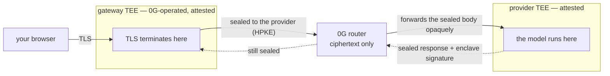

# Why this is private

Why 0G cannot read the prompts you send to the Private Computer — and how you check
that for yourself instead of believing it.

This is the short version. The procedure is
[`verifying-the-gateway.md`](./verifying-the-gateway.md); the design is under
[`design/`](./design/).

---

## The short answer

**Your prompt is encrypted before it leaves your browser, and the plaintext only ever
exists inside TEE memory.** 0G's router — the layer that carries and bills every
request — holds nothing but ciphertext, from end to end. That part is unconditional:
the request body is sealed to the provider's enclave key, and the router does not have
that key.

**TEE memory is not readable from outside the TEE.** Not by the cloud machine the
enclave runs on, not by 0G's operators. The encryption keys are generated inside the
enclave and never leave it. This is a property of the hardware, not a setting we
promise to keep.

**There are two TEEs on this path: the access gateway, which 0G operates, and the
provider enclave that runs the model.** Because one of them is ours, we publish its
complete evidence — a hardware-signed attestation, the hash of the exact build that
is running, and where that build came from — so you can verify it rather than take
our word for it. That is what the rest of this document is about.

---

## Where your prompt goes

| Stage | Form | Note |
|---|---|---|
| your browser → the gateway | **ciphertext** (TLS) | the TLS session ends *inside* the gateway TEE, not at a load balancer in front of it |
| inside the gateway TEE | plaintext, in memory | unreadable from outside the enclave |
| the gateway → the provider | **ciphertext** (HPKE, sealed to the provider enclave's key) | this is the only form 0G's router ever carries |
| 0G's router | **ciphertext only** | it can route and bill; it cannot open the body |
| inside the provider enclave | plaintext, in memory | the model runs here, in the same TEE |
| the response, coming back | **ciphertext** + a signature from the enclave | the router can neither read it nor forge it |



Nothing on that path writes your prompt to a disk, a log, or a backup. Because the
build that runs in the gateway is pinned by its attestation (below), that is something
you can read out of published source rather than something you have to be told.

---

## Why "inside a TEE" is checkable rather than asserted

Three mechanisms, and each one is verifiable by a stranger with no access to 0G.

**The TLS key is born inside the enclave.** The gateway's ingress generates its own TLS
private key inside the confidential VM, obtains a certificate for the domain, and then
commits to that certificate inside a hardware-signed Intel TDX attestation quote. If the
certificate your connection negotiated is the one the quote commits to, then your TLS
session terminates *inside* that enclave — and nobody outside it holds the key, including
0G's own operators and the cloud host.

**The code is pinned by a hash that Intel signs.** The same quote commits to a hash of
the CVM's deployment manifest, and that manifest pins every container image by digest.
Change the code and the hash changes; the hash lives in a hardware-signed report, so the
change is visible to anyone who looks. Resolve the hash and you know exactly which build
is answering you, and can compare it against the releases published in this repository.

**The provider is verified before your prompt is sealed to it, and its answer is
signed.** The gateway fetches the provider's own attestation quote, DCAP-verifies it
against Intel's roots, and reads the provider's encryption key out of the *verified*
quote — never from the router, which is treated as untrusted throughout. A provider whose
quote does not verify is not used. A response whose enclave signature does not verify is
not returned to you.

---

## Check it yourself

One command, run from anywhere, against a domain you name:

```sh
git clone https://github.com/0gfoundation/0g-pc-e2ee
cd 0g-pc-e2ee/client && go build -o pcverify ./cmd/pcverify

./pcverify -gateway <gateway-domain>
```

It fetches the attestation evidence the gateway publishes, verifies the quote against
Intel's roots, checks that the certificate *your connection* was served is the one the
quote binds, resolves the code hash, and compares the running build against the published
releases. It trusts 0G for none of that, and
[the same procedure by hand](./verifying-the-gateway.md#doing-it-by-hand) uses nothing but
`curl`, `openssl`, `jq` and `sha256sum`.

What a pass means, what a partial run means, and what each failure indicates are in
[`verifying-the-gateway.md`](./verifying-the-gateway.md).

---

## What we can still see

Encrypting the body does not hide everything around it, and it would be dishonest to
imply otherwise:

- **the model you asked for** — the router routes on it, so it is cleartext;
- **your exact token usage** — cleartext, because the router bills on it. Exact, not
  approximate;
- **message sizes** — a ciphertext is its plaintext's length plus a constant, so sizes
  are not obscured;
- **timing** — including per-chunk timing on a streamed response.

The router cannot *alter* any of it: those fields are bound into the encryption and
covered by the enclave's signature, so it reads and bills but cannot forge.

---

## What this does not prove

- **Detection, not prevention.** These checks make a dishonest deployment *publicly
  detectable*; they do not make it impossible. Detection requires that somebody actually
  run the verification — a user who never does is trusting 0G by default.
- **Verification covers the connection that was checked.** One domain can be served by
  several enclaves, each with its own key, so a pass describes the connection the tool
  made, not automatically the one your browser has open.
- **Verifiable relay, not verifiable computation.** The chain proves that the attested
  enclave produced *this* response to *this* request. It does not prove anything about
  the quality or behaviour of the model running inside it.
- **Availability is not attested.** Nothing here stops a deployment from being taken
  offline.
- **The hosted gateway is one more attested party than sealing on your own machine.**
  If a second enclave holding plaintext is unacceptable for your use case, the
  client-side forms in [`../client/README.md`](../client/README.md) seal on your own
  hardware — but neither is offered as a supported entry point today, so the honest
  answer is that the hosted product is not the right shape for you yet.

---

## Going deeper

| | |
|---|---|
| [`verifying-the-gateway.md`](./verifying-the-gateway.md) | the full procedure: every check one at a time, exit codes, the manual form, and the current limits in full |
| [`design/trust-chain.md`](./design/trust-chain.md) | every hop, what its trust bottoms out on, and which links are enforced versus only observed |
| [`design/cloud-gateway.md`](./design/cloud-gateway.md) | why the gateway exists, and why its quote comes from the ingress rather than the gateway process |
| [`../protocol/SPEC.md`](../protocol/SPEC.md) | the normative wire format: how requests are sealed and responses proven |
</content>
</invoke>
