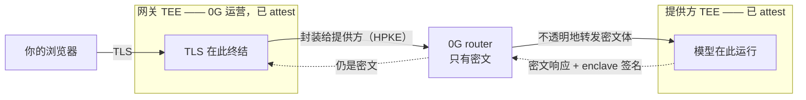

# 为什么它是私密的

为什么 0G 读不到你发给 Private Computer 的 prompt——以及你如何自己验证这件事，
而不是相信我们。

这是简版。完整验证流程见
[`verifying-the-gateway.md`](./verifying-the-gateway.md)（英文），设计文档在
[`design/`](./design/)。本文是
[`why-this-is-private.md`](./why-this-is-private.md) 的中文版，以英文版为准。

---

## 一句话的答案

**你的 prompt 的明文只在 TEE 内存中存在过。** 把它送进去用的是普通 TLS，和任何 HTTPS
网站一样；不普通的地方在于这条 TLS **在哪里终结**——在 enclave 内部，用一把在里面生成的
密钥，而不是在运营方控制的负载均衡器上。从这里往后，0G 的 router——承载并计费每一个请求的
那一层——从头到尾只持有密文。这一条是无条件的：请求体被封装给提供方 enclave 的密钥，而
router 没有那把密钥。

**TEE 内存无法从 TEE 之外读取。** 宿主机读不到，0G 的运维也读不到。加密密钥在 enclave
内部生成，从不导出。这是硬件的性质，不是我们承诺去遵守的一项配置。

**这条路径上有两个 TEE：0G 运营的接入网关，以及运行模型的提供方 enclave。**
正因为其中一个是我们自己运营的，我们把它的完整证据公开——硬件签名的 attestation、正在
运行的那份构建的哈希、以及这份构建的来源——好让你能验证它，而不是只能听我们说。本文余下
的部分讲的就是这件事。

---

## 你的 prompt 经过哪里

| 阶段 | 形态 | 说明 |
|---|---|---|
| 浏览器 → 网关 | **密文**（普通 TLS） | 会话在网关 TEE *内部* 终结，而不是在它前面的负载均衡器上。封装给提供方这一步发生在网关里，不在你的浏览器里 |
| 网关 TEE 内部 | 明文，仅在内存中 | 从 enclave 外部不可读 |
| 网关 → 提供方 | **密文**（HPKE，封装给提供方 enclave 的密钥） | 这是 0G 的 router 唯一接触到的形态 |
| 0G 的 router | **只有密文** | 它能路由、能计费，但打不开请求体 |
| 提供方 enclave 内部 | 明文，仅在内存中 | 模型就在这同一个 TEE 里运行 |
| 返回的响应 | **密文** + enclave 的签名 | router 既读不到，也伪造不了 |



这条路径上没有任何一环把你的 prompt 写进磁盘、日志或备份。由于网关里运行的那份构建被它
的 attestation 钉死（见下节），这一点是你可以从公开源码里读出来的，而不是只能被告知。

---

## 为什么"在 TEE 里"是可检查的，而不是声称的

三个机制，每一个都能被一个完全没有 0G 权限的陌生人独立验证。

**TLS 密钥诞生在 enclave 内部。** 网关的 ingress 在机密虚拟机内部生成自己的 TLS 私钥、
为该域名申请证书，然后把这张证书**承诺进一份硬件签名的 Intel TDX attestation quote**。
如果你的连接协商到的证书就是 quote 所承诺的那一张，那么你的 TLS 会话就是在那个 enclave
*内部* 终结的——而 enclave 之外没有任何人持有那把密钥，包括 0G 自己的运维和云厂商。

**代码被一个由 Intel 签名的哈希钉住。** 同一份 quote 还承诺了 CVM 部署清单的哈希，而这
份清单用 digest 钉死了每一个容器镜像。改代码，哈希就变；哈希在硬件签名的报告里，所以这个
变化对任何愿意去看的人都是可见的。把哈希还原回清单，你就确切知道是哪份构建在回答你，并
可以拿它和本仓库发布的 release 比对。

**在把你的 prompt 封装给提供方之前，提供方先被验证过；它的回答带签名。** 网关会取回提供方
自己的 attestation quote，用 Intel 的根证书做 DCAP 验证，并从**已验证的** quote 里读出
提供方的加密公钥——绝不从 router 读，router 在整条链路里都被当作不可信。quote 验证不通过的
提供方不会被使用；enclave 签名验证不通过的响应不会返回给你。

---

## 自己验一遍

一条命令，在任何地方对你指定的域名运行：

```sh
git clone https://github.com/0gfoundation/0g-pc-e2ee
cd 0g-pc-e2ee/client && go build -o pcverify ./cmd/pcverify

./pcverify -gateway <gateway-domain>
```

它会取回网关公开的 attestation 证据、对着 Intel 的根验证 quote、检查**你这条连接**实际
收到的证书是否就是 quote 绑定的那一张、还原代码哈希、并把运行中的构建与已发布的 release
比对。以上没有一步需要信任 0G，而
[同一套流程的手工版本](./verifying-the-gateway.md#doing-it-by-hand)
只用到 `curl`、`openssl`、`jq` 和 `sha256sum`。

通过意味着什么、部分通过意味着什么、每一种失败分别指向什么，见
[`verifying-the-gateway.md`](./verifying-the-gateway.md)。

---

## 我们仍然能看到什么

加密请求体并不能隐藏它周围的一切，暗示相反的事情是不诚实的：

- **你请求的模型**——router 要靠它路由，所以是明文；
- **你的精确 token 用量**——明文，因为 router 要靠它计费。是精确值，不是近似值；
- **消息大小**——密文长度等于明文长度加一个常数，所以大小并未被掩盖；
- **时序**——包括流式响应中每个分片的时间。

router 不能**篡改**其中任何一项：这些字段被绑定进加密结构、并被 enclave 的签名覆盖，所以
它能读、能计费，但伪造不了。

---

## 这不能证明什么

- **可检测，不是被阻止。** 这些检查让一个不诚实的部署**可以被公开检测出来**，但并不使它
  无法存在。检测的前提是真的有人去跑验证——从不验证的用户，等于默认信任了 0G。
- **验证覆盖的是被检查的那条连接。** 一个域名可以由多个 enclave 提供服务，各自持有自己的
  密钥，所以一次通过描述的是工具建立的那条连接，不自动等同于你浏览器里打开的那条。
- **可验证的传递，不是可验证的计算。** 这条链证明了那个已 attest 的 enclave 针对**这一个**
  请求产生了**这一个**响应；它不证明里面运行的模型的质量或行为。
- **可用性不在 attestation 范围内。** 这里没有任何东西能阻止一个部署被下线。
- **托管网关比在你自己机器上封装多了一个受 attest 的参与方。** 如果多一个持有明文的
  enclave 对你的场景不可接受，[`../client/README.md`](../client/README.md) 里的客户端形态
  可以在你自己的硬件上完成封装——但它们目前都不作为受支持的入口提供，所以诚实的答案是：
  托管形态现在还不适合你。

---

## 继续深入

| | |
|---|---|
| [`verifying-the-gateway.md`](./verifying-the-gateway.md) | 完整流程：逐项检查、退出码、手工验证形式，以及全部的当前限制 |
| [`design/trust-chain.md`](./design/trust-chain.md) | 每一跳、它的信任落在哪里，以及哪些环节是强制执行的、哪些只是观测 |
| [`design/cloud-gateway.md`](./design/cloud-gateway.md) | 网关为什么存在，以及它的 quote 为什么来自 ingress 而不是网关进程本身 |
| [`../protocol/SPEC.md`](../protocol/SPEC.md) | 规范性的线格式：请求如何被封装、响应如何被证明 |
</content>
